#### 安装

##### 安装 Elasticsearch

下载安装包安装

```
wget https://artifacts.elastic.co/downloads/elasticsearch/elasticsearch-7.3.0-x86_64.rpm
rpm -vi elasticsearch-7.3.0-x86_64.rpm
```

修改配置文件 /etc/elasticsearch/elasticsearch.yml

```
network.host: 188.188.1.151
cluster.initial_master_nodes: ["centos76-001"]
```

修改 jvm 文件 /etc/elasticsearch/jvm.options 

```
-Xms2g
-Xmx2g
```

启动 Elasticsearch

```
systemctl start elasticsearch
```


##### 安装 Kibana

下载安装包安装

```
wget https://artifacts.elastic.co/downloads/kibana/kibana-7.3.0-linux-x86_64.tar.gz
tar xzvf kibana-7.3.0-linux-x86_64.tar.gz -C /usr/local/
cd /usr/local/
mv kibana-7.3.0-linux-x86_64 kibana
useradd kibana
chown -R kibana.kibana kibana/
```

修改配置文件 kibana/config/kibana.yml

```
server.host: 188.188.1.151
elasticsearch.hosts: ["http://188.188.1.151:9200"]
```

启动 Kibana

```
su - kibana -c "nohup /usr/local/kibana/bin/kibana >/dev/null 2>&1 &"
```


##### 安装 Filebeat

下载安装包安装

```
wget https://artifacts.elastic.co/downloads/beats/filebeat/filebeat-7.3.0-x86_64.rpm
rpm -vi filebeat-7.3.0-x86_64.rpm
```

修改配置文件 /etc/filebeat/filebeat.yml 

```
output.elasticsearch:
  hosts: ["188.188.1.151:9200"]
```

启动 Filebeat

```
systemctl start filebeat
```


#### 收集 Niginx 日志

##### 使用 Filebeat 采集 Nginx Access 日志

查看 Filebeat 已启用的 模块

```
filebeat modules list
```

启用 Niginx 模块

```
filebeat modules enable nginx
```

修改 Nginx 模块配置文件 /etc/filebeat/modules.d/nginx.yml 指定 Ningx Access 日志文件

```
- module: nginx
  access:
    enabled: true
    var.paths: ["/var/log/nginx/access.log"]
```

修改 Filebeat 配置文件 /etc/filebeat/filebeat.yml，重新定义 index 名称

> indexname 可以自行更改做区分

```
output.elasticsearch.index: "%{[event.dataset]}-%{+yyyy.MM.dd}-indexname"
setup.template.name: "log"
setup.template.pattern: "log-*"
setup.ilm.enabled: false
```

变量 event.dataset 对应的值是 nginx.access，Kibana 中显示的很多变量可以使用

  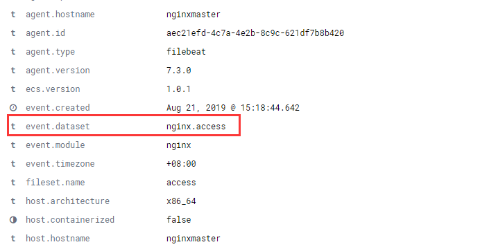

重启 Filebeat

```
systemctl restart filebeat
```

配置 Nginx Access 日志格式

```
log_format  main  '$remote_addr - $remote_user [$time_local] "$request" '
                  '$status $body_bytes_sent "$http_referer" "$http_user_agent"';
```

重新加载 Nginx 配置文件

```
nginx -s reload
```

在 Kibana 中查看 Elasticsearch 的索引

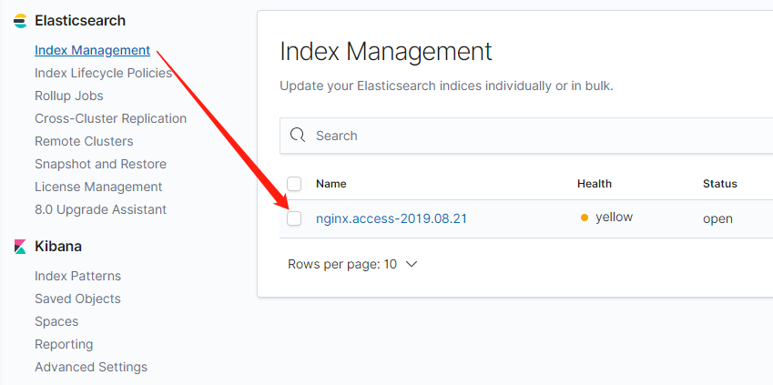

将 Elasticsearch 的索引添加到 Kibana

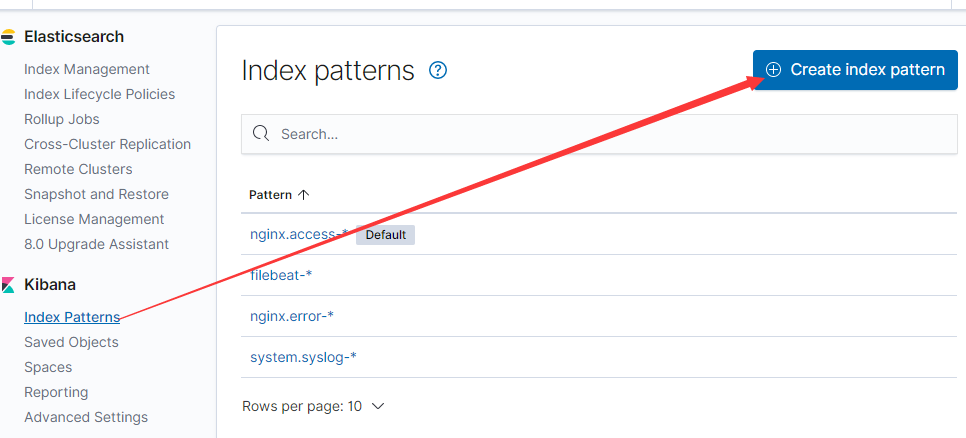

在 Kibana 中查看日志记录

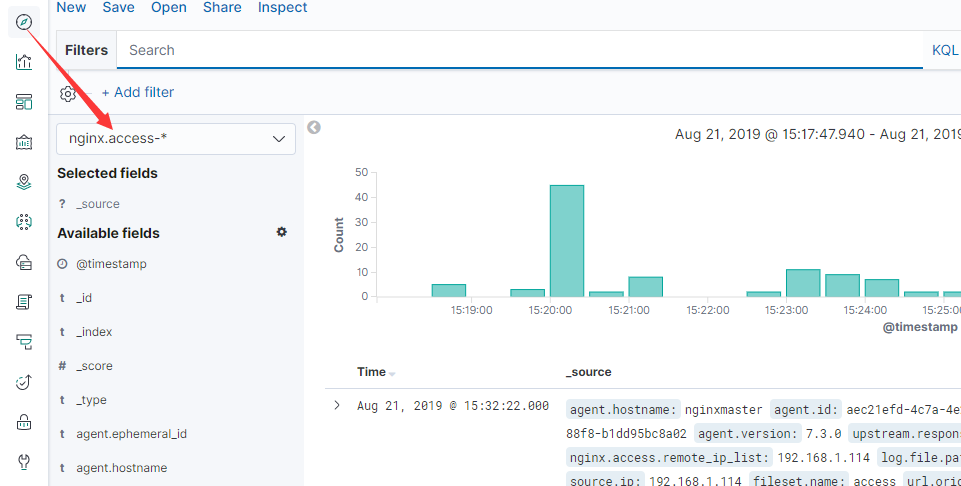


##### 新增 Nginx Access 日志字段

> 参考文档：[Filebeat Nginx Module 自定义](https://www.iamle.com/archives/2610.html)

在 Nginx Access 日志中添加以下字段

```
"$host" "$uri" "$upstream_addr" $upstream_response_time $request_time
```

新增后的日志格式

```
log_format  main  '$remote_addr - $remote_user [$time_local] "$request" $status '
                  '$body_bytes_sent "$http_referer" "$http_user_agent" "$host" '
                  '"$uri" "$upstream_addr" $upstream_response_time $request_time';
```

找到文件 /usr/share/filebeat/module/nginx/access/ingest/default.json 中的以下行

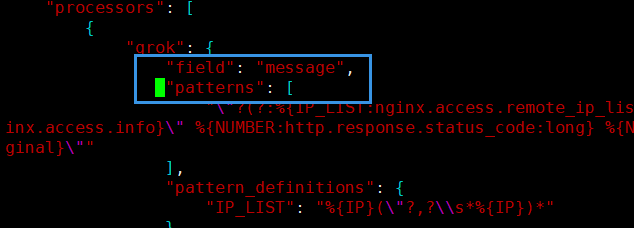

在行尾添加以下内容

> upstream.response.time 必须设置为 DATA 类型即字符串类型，否则当 upstream.response.time 的值获取不到时，则该条记录无法解析。 状态码为 503 的日志会被丢弃。

```
\"%{DATA:http.server.name}\" \"%{DATA:http.uri}\" \"%{DATA:upstream.addr}\" %{DATA:upstream.response.time} %{NUMBER:http.request.time:float}
```

修改文件 /etc/filebeat/fields.yml ，在 Nginx 模块添加以下行

```
            - name: server_name
              type: alias
              path: http.server.name
              migration: true
            - name: uri
              type: alias
              path: http.uri
              migration: true
            - name: upstream_addr
              type: alias
              path: upstream.addr
              migration: true
            - name: upstream_response_time
              type: alias
              path: upstream.response.time
              migration: true
            - name: request_time
              type: alias
              path: http.request.time
              migration: true
```

重启 Filebeat

```
systemctl restart filebeat
```

使用 Kibana Dev Tools 删除 pipeline

```
DELETE _ingest/pipeline/*
```


重启 Elasticsearch

```
systemctl restart elasticsearch
```

在 Kibana 中查看新增的字段

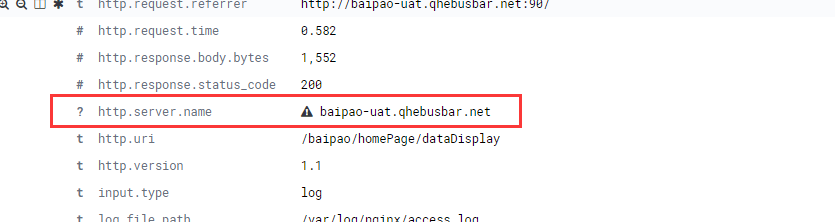

刷新 index 字段去除三角形提示

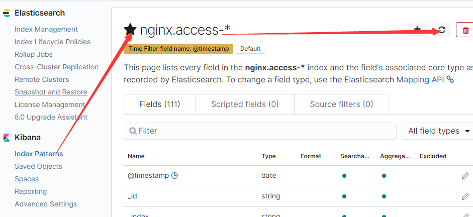

三角形已经消失

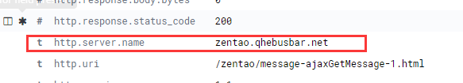


删除文件 /usr/share/filebeat/module/nginx/access/ingest/default.json  中的以下内容，保留 message

> 执行 DELETE _ingest/pipeline/*
>
> 重启全部 filebeat

```
		{
            "remove": {
                "field": "message"
            }
        },
```


##### 实现 Kibana 以 Nginx 日志中的时间作为时间轴 

删除文件 /usr/share/filebeat/module/nginx/access/ingest/default.json  中的以下内容

```
        {
            "remove": {
                "field": "nginx.access.time"
            }
        },
```

在文件 /usr/share/filebeat/module/nginx/access/ingest/default.json 中添加以下内容

```
        {
            "date": {
                "field": "nginx.access.time",
                "target_field": "log.time",
                "formats": [
                    "dd/MMM/yyyy:H:m:s Z"
                ],
                "ignore_failure": true
            }
        },
```

重启 Filebeat

```
systemctl restart filebeat
```

使用 Kibana Dev Tools 删除 pipeline

```
DELETE _ingest/pipeline/*
```


重启 Elasticsearch

```
systemctl restart elasticsearch
```

在 Kibana 添加 Index 时选择 log.time

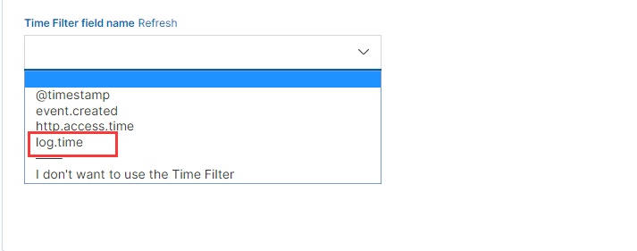


##### 使用 Filebeat 采集 Nginx Error 日志

启用 Nginx 模块

```
filebeat modules enable nginx
```

修改 Nginx 模块配置文件 /etc/filebeat/modules.d/nginx.yml ，指定错误文件

```
error:
    enabled: true
    var.paths: ["/var/log/nginx/error.log"]
```

修改 Nginx 模块 pipeline 文件 /usr/share/filebeat/module/nginx/error/ingest/pipeline.json，设置时区

```
{
    "date": {
      "field": "nginx.error.time",
      "target_field": "@timestamp",
      "formats": ["yyyy/MM/dd H:m:s"],
      "ignore_failure": true,
      "timezone": "Asia/Shanghai"
    }
}
```

重启 Filebeat

```
systemctl restart filebeat
```

使用 Kibana Dev Tools 删除 pipeline

```
DELETE _ingest/pipeline/*
```


重启 Elasticsearch

```
systemctl restart elasticsearch
```

通过 Kibana 查看 Nginx Error 日志的 Index

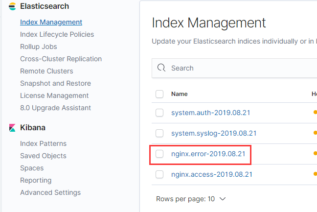


#### 收集 Java 日志

> 目的：实现程序员不登录服务器查看历史日志和实时日志。

修个 Filebeat 配置文件 /etc/filebeat/filebeat.yml

> 设置 fileds.modelname 的目的是实现不同项目的日志生成不同的索引。
>
> 在 output.elasticsearch.index 中指定该字段，定义索引名。

```
filebeat.inputs:
- type: log
  enabled: true
  paths:
    - /usr/local/baipao/contract/applog/*/*.log
  fields:
    modelname: contract

- type: log
  enabled: true
  paths:
    - /usr/local/baipao/manager/applog/*/*.log
  fields:
    modelname: manager

- type: log
  enabled: true
  paths:
    - /usr/local/baipao/driverapp/applog/*/*.log
  fields:
    modelname: driverapp

output.elasticsearch:
  hosts: ["188.188.1.135:9200"]

output.elasticsearch.index: "%{[fields.modelname]}-%{+yyyy.MM.dd}"
setup.template.name: "log"
setup.template.pattern: "log-*"
setup.ilm.enabled: false
```

重启 Filebeat

```
systemctl restart filebeat
```

在 Kibana 中查看生成的索引


配置要查看的索引

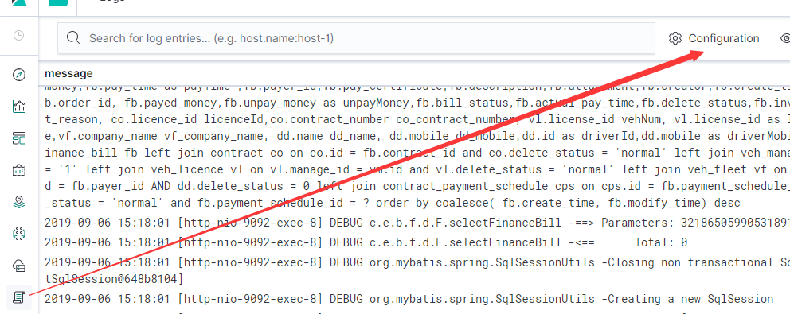

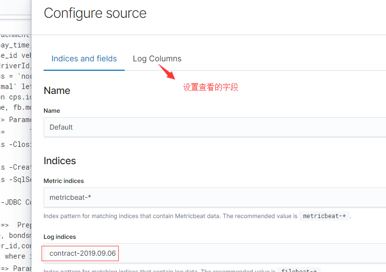

启用实时滚动查看

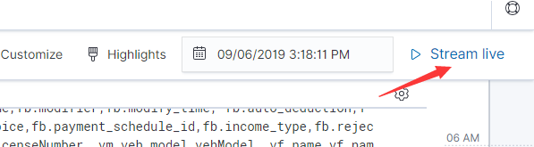