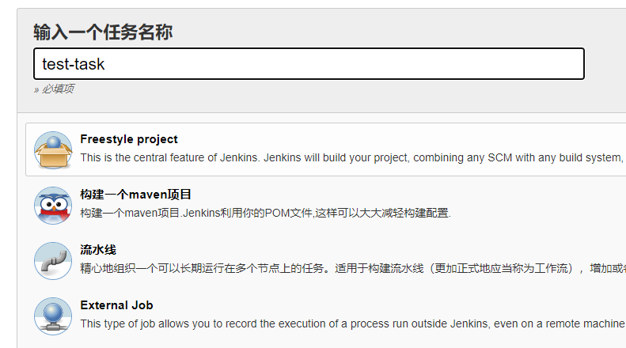
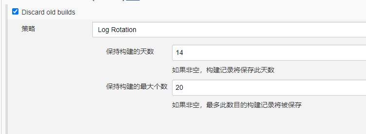
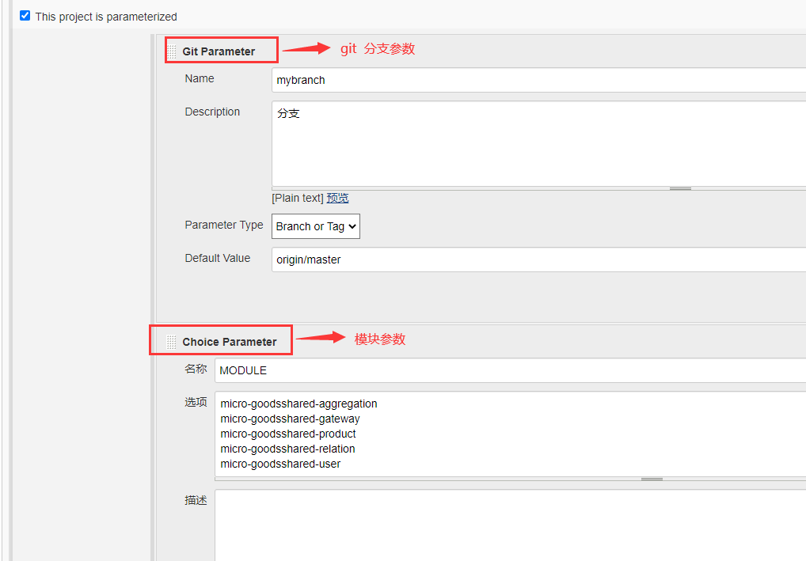
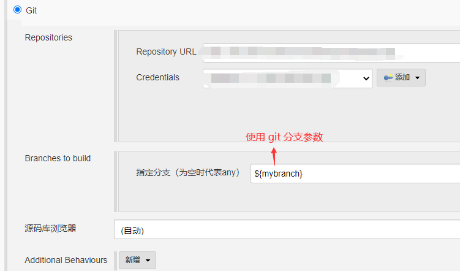
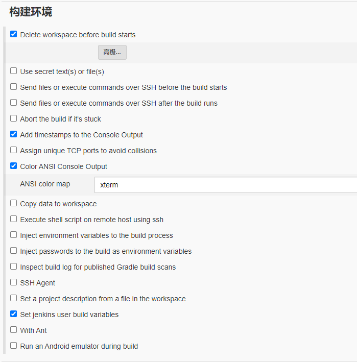
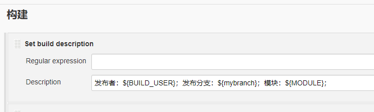
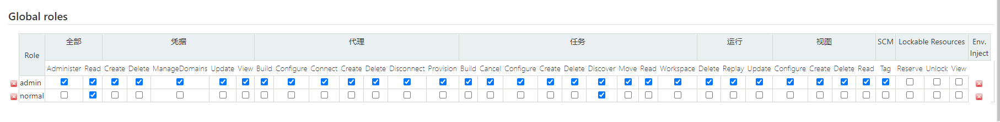
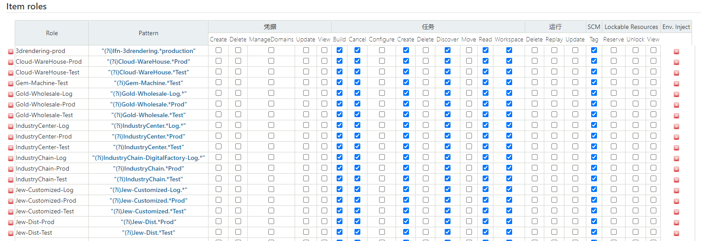
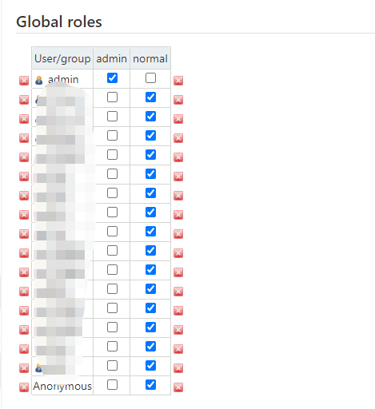
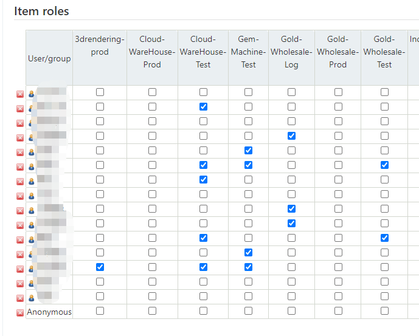

##### 创建参数化的任务

> git 分支和模块参数化

新增任务

设置保留构建记录

设置参数

使用 git 参数

使用模块参数

构建环境常用设置

记录构建信息

##### 权限管理

添加插件 [Role-based Authorization Strategy](https://plugins.jenkins.io/role-strategy)

定义用户角色

定义项目角色

用户角色关联

用户项目关联

