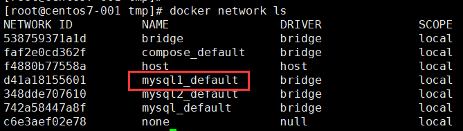
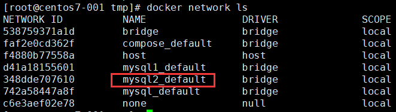

#### 安装 docker

```
# 安装依赖包
yum install yum-utils device-mapper-persistent-data lvm2
# 配置yum 源
yum-config-manager --add-repo https://download.docker.com/linux/centos/docker-ce.repo
# 安装
yum install docker-ce docker-ce-cli containerd.io
# 配置
mkdir /etc/docker
# Setup daemon.
cat > /etc/docker/daemon.json <<EOF
{
  "exec-opts": ["native.cgroupdriver=systemd"],
  "log-driver": "json-file",
  "log-opts": {
    "max-size": "100m"
  },
  "storage-driver": "overlay2",
  "storage-opts": [
    "overlay2.override_kernel_check=true"
  ]
}
EOF

mkdir -p /etc/systemd/system/docker.service.d

# 启动
systemctl daemon-reload
systemctl enable docker
systemctl start docker
```


#### 常用命令

##### Docker

创建 docker

```
docker run -id <REPOSITORY:TAG>   
```

创建有端口映射的 docker

```
docker run -id -p 9090:9090 REPOSITORY:TAG
```

创建有目录映射的 docker

```
docker run -id -v /host_dir:/docker_dir REPOSITORY:TAG
```

登陆 docker

```
docker exec -it <CONTAINER ID> /bin/bash
```

查看所有已经创建的 docker

```
docker ps -a
```

查看正在运行的 docker

```
docker ps
```

删除 docker

```
docker rm <CONTAINER ID>
```

启动 docker

```
docker start <CONTAINER ID>
```

停止 docker

```
docker stop <CONTAINER ID>
```

查看 docker 创建详情

```
docker history 28bad97b3d94
```

##### 镜像

下载镜像

```
docker pull <REPOSITORY:TAG>
```

删除镜像

```
docker rmi <REPOSITORY:TAG>
```

生成镜像

```
docker build -t <REPOSITORY:TAG> .
```


#### 生成 Docker 镜像

##### 生成 jdk 1.8 镜像

创建 Dockerfile 文件

> 需要提前下载好 jdk-8u151-linux-x64.tar.gz

```
FROM centos:7.6.1810

ADD jdk-8u151-linux-x64.tar.gz /usr/local/

ENV JAVA_HOME /usr/local/jdk1.8.0_151
ENV CLASSPATH $JAVA_HOME/lib/dt.jar:$JAVA_HOME/lib/tools.jar
ENV PATH $PATH:$JAVA_HOME/bin

RUN ln -sf /usr/share/zoneinfo/Asia/Shanghai /etc/localtime
RUN sh -c echo 'Asia/Shanghai' >/etc/timezone
```

生成镜像

```
docker build --no-cache -t oraclejdk:1.8 .
```

创建 docker

```
docker run -id oraclejdk:1.8
```

登陆 docker 测试 java 版本和时区

```
[root@gpsdb01 centos]# docker exec -it 8d76c676b4e9 /bin/bash
[root@8d76c676b4e9 /]# java -version
java version "1.8.0_151"
Java(TM) SE Runtime Environment (build 1.8.0_151-b12)
Java HotSpot(TM) 64-Bit Server VM (build 25.151-b12, mixed mode)
[root@8d76c676b4e9 /]# date
Wed Sep  4 18:25:53 CST 2019
```

##### 生成运行 jar 包的镜像

创建 Dockerfile

```
FROM oraclejdk:1.8
RUN mkdir /usr/local/eureka
ADD baipao-eureka.jar /usr/local/eureka
ENTRYPOINT ["java", "-jar", "/usr/local/eureka/baipao-eureka.jar"] 
```

生成镜像

```
docker build --no-cache -t eureka.jar:1.0 .
```

创建 docker

```
docker run -id -p 9090:9090 eureka.jar:1.0 
```

##### 生成 redis 镜像

创建 Dockerfile 文件

> redis.conf 下载地址 http://download.redis.io/redis-stable/redis.conf
>
> bind 和 requirepass 需要修改

```
FROM redis:6.0
RUN ln -sf /usr/share/zoneinfo/Asia/Shanghai /etc/localtime
COPY redis.conf /usr/local/etc/redis/redis.conf
CMD [ "redis-server", "/usr/local/etc/redis/redis.conf" ]
```

生成镜像

```
docker build --no-cache -t redis-cst:6.0 .
```

创建 docker

```
docker run -id -p 6379:6379 redis-cst:6.0
```


#### Docker Compose

##### 安装

```
# curl -L "https://github.com/docker/compose/releases/download/1.26.2/docker-compose-$(uname -s)-$(uname -m)" -o /usr/local/bin/docker-compose
# chmod +x /usr/local/bin/docker-compose
```

##### 开始使用

创建实例程序文件 app.py

> host='redis' : redis 为 redis 的服务名，同一 docker-compose 的服务可以使用服务名进行通信。 

```
import time

import redis
from flask import Flask

app = Flask(__name__)
cache = redis.Redis(host='redis', port=6379)


def get_hit_count():
    retries = 5
    while True:
        try:
            return cache.incr('hits')
        except redis.exceptions.ConnectionError as exc:
            if retries == 0:
                raise exc
            retries -= 1
            time.sleep(0.5)


@app.route('/')
def hello():
    count = get_hit_count()
    return 'Hello World! I have been seen {} times.\n'.format(count)
```

创建安装依赖文件 requirements.txt

```
flask
redis
```

创建应用 Dockerfile

> COPY . . : 把当前目录所有的文件拷贝到容器工作目录

```
FROM python:3.7-alpine
WORKDIR /code
ENV FLASK_APP app.py
ENV FLASK_RUN_HOST 0.0.0.0
RUN apk add --no-cache gcc musl-dev linux-headers
COPY requirements.txt requirements.txt
RUN pip install -r requirements.txt
COPY . .
CMD ["flask", "run"]
```

创建 docker-compose.yml

```
version: '3'
services:
  web:
    build: .
    ports:
      - "5000:5000"
  redis:
    image: "redis:alpine"
```

启动

```
docker-compose up -d
```

修改 docker-compose 文件，挂载盘和设置环境变量

```
version: '3'
services:
  web:
    build: .
    ports:
      - "5000:5000"
    volumes:
      - .:/code
    environment:
      - FLASK_ENV=development
  redis:
    image: "redis:alpine"
```

更新

```
docker-compose up -d
```

##### 网络

> docker-compose 以 yml 文件所在的目录为单位创建网络
>
> 同一目录中的服务可以使用服务器互相通信

运行 mysql1 目录的服务

```
docker-compose -f /root/mysql1/compose-mysql.yml -d
```

生成 mysql1_default 网络



运行 mysql2 目录的服务

```
docker-compose -f /root/mysql2/compose-mysql.yml up -d
```

生成 mysql2_default 网络




#### Docker Compose 实例

##### 部署 MySQL

创建 yml 文件 compose-mysql.yml

> 主配置文件会包含 /etc/mysql/conf.d 目录中的配置文件

```
version: '3.1'
services:
  mysql-service:
    image: mysql:5.7.30
    restart: always
    environment:
      - MYSQL_ROOT_PASSWORD=MySQL5.7
    ports:
      - 3366:3306
    volumes:
      - /data/mysql-data:/var/lib/mysql
      - /data/mysql-conf:/etc/mysql/conf.d
```

创建 MySQL 配置文件 /data/mysql-conf/config-mysql.cnf

```
[mysqld]
# general
server_id=1
max_connections=2000
table_open_cache=10000
open_files_limit=65536
character-set-server=utf8mb4
skip_name_resolve=on
gtid_mode=on
enforce_gtid_consistency=on
tmp_table_size=64M
max_heap_table_size=64M
max_allowed_packet=64M
innodb_data_file_path=ibdata1:12M:autoextend:max:4096M
range_optimizer_max_mem_size=64M
read_rnd_buffer_size=8M
join_buffer_size=8M
sort_buffer_size=8M

# log
log_timestamps=system
binlog_format=row
log_bin=mysql-bin
slow_query_log=1
long_query_time=2
slow_query_log_file=slow.log
expire-logs-days=7
innodb_flush_log_at_trx_commit=1
sync_binlog=1

# innodb
innodb_buffer_pool_size=2G
innodb_log_buffer_size=128M
innodb_log_file_size=1G
innodb_read_io_threads=8
innodb_write_io_threads=8
```

运行

```
docker-compose -f compose-mysql.yml up -d
```

重启

```
docker-compose -f compose-mysql.yml restart
```

停止

```
docker-compose -f compose-mysql.yml stop
```

删除

```
docker-compose -f compose-mysql.yml rm
```

##### 部署 mindoc

> mindoc 的数据保存在 MySQL 或 sqlite3
>
> 需要备份数据库和 uploads 目录

docker-compose.yml 文件

```
MinDoc_New:
  image: registry.cn-hangzhou.aliyuncs.com/mindoc/mindoc:v2.0-beta.2
  privileged: false
  restart: always
  ports:
    - 8181:8181
  volumes:
    - /data/mindoc/database:/mindoc/database
    - /data/mindoc/uploads:/mindoc/uploads
  environment:
    - MINDOC_RUN_MODE=prod
    - MINDOC_DB_ADAPTER=sqlite3
    - MINDOC_DB_DATABASE=./database/mindoc.db
    - MINDOC_CACHE=true
    - MINDOC_CACHE_PROVIDER=file
    - MINDOC_ENABLE_EXPORT=false
    - MINDOC_BASE_URL=
    - MINDOC_CDN_IMG_URL=
    - MINDOC_CDN_CSS_URL=
    - MINDOC_CDN_JS_URL=
  dns:
    - 223.5.5.5
    - 223.6.6.6
```

##### 部署 zabbix 监控系统

创建 zabbix/docker-compose.yml

> 注意：没有挂载盘重新创建容器后修改会丢失，数据库中的数据也会丢失，会重新初始化数据。

```
version: '3.1'
services:
  server:
    image: zabbix/zabbix-server-mysql
    restart: always
    environment:
      - DB_SERVER_HOST=mysql
      - MYSQL_USER=root
      - MYSQL_PASSWORD=MySQL5.7
    ports:
      - 10051:10051
    depends_on:
      - mysql
  web:
    image: zabbix/zabbix-web-nginx-mysql
    restart: always
    environment:
      - DB_SERVER_HOST=mysql
      - MYSQL_USER=root
      - MYSQL_PASSWORD=MySQL5.7
      - ZBX_SERVER_HOST=server
      - PHP_TZ=Asia/Shanghai
    ports:
      - 6060:8080
    depends_on:
      - mysql
      - server
  mysql:
    image: mysql:5.7.30
    restart: always
    environment:
      - MYSQL_ROOT_PASSWORD=MySQL5.7
    ports:
      - 3366:3306
    volumes:
      - /data/mysql-data:/var/lib/mysql
      - /data/mysql-conf:/etc/mysql/conf.d
```

启动

> 访问地址：http://host-ip:6060 默认用户名 Admin，默认密码 zabbix

```
cd zabbix
docker-compose up -d
```

##### 部署 dubbo-admin

创建 docker-compose.yml 文件

```
version: '3'

services:
  zookeeper:
    image: zookeeper
    ports:
      - 2181:2181
  admin:
    image: apache/dubbo-admin
    depends_on:
      - zookeeper
    ports:
      - 8080:8080
    environment:
      - admin.registry.address=zookeeper://zookeeper:2181
      - admin.config-center=zookeeper://zookeeper:2181
      - admin.metadata-report.address=zookeeper://zookeeper:2181
```

启动

> 访问地址:  http://hostip:8080 

```
docker-compose up -d
```


#### 管理

##### 实现非 root 用户运行 docker 命令

 将用户加入到 docker 组

```
gpasswd -a devops docker
```

重新登录用户即可执行 docker 命令

##### 配置镜像加速器

修改daemon配置文件 /etc/docker/daemon.json 来使用加速器

```
sudo mkdir -p /etc/docker
sudo tee /etc/docker/daemon.json <<-'EOF'
{
  "registry-mirrors": ["https://mw9jlg9p.mirror.aliyuncs.com"]
}
EOF
sudo systemctl daemon-reload
sudo systemctl restart docker
```