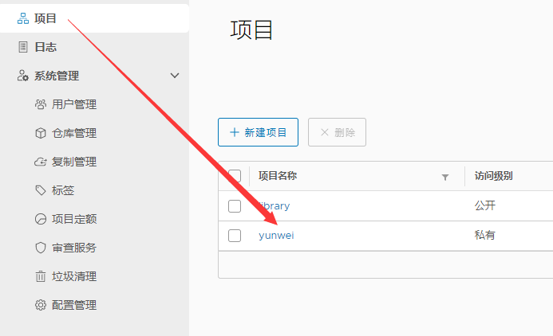
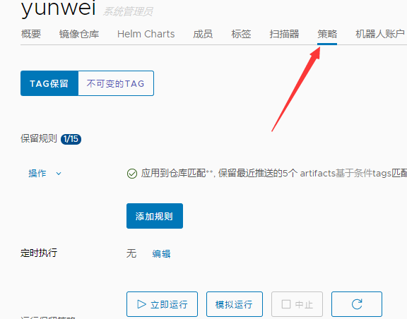

##### 安装

下载安装包

```
wget https://github.com/goharbor/harbor/releases/download/v2.0.2/harbor-offline-installer-v2.0.2.tgz
tar zxvf harbor-offline-installer-v2.0.2.tgz -C /data
```

准备配置文件

```
cd /data/harbor
cp harbor.yml.tmpl harbor.yml
```

修改配置文件 harbor.yml

```
# nginx SSL 证书
hostname: harbor.huhaiqing.xyz
https:
  # https port for harbor, default is 443
  port: 443
  # The path of cert and key files for nginx
  certificate: /data/harbor/cert/harbor.huhaiqing.xyz.pem
  private_key: /data/harbor/cert/harbor.huhaiqing.xyz.key
# admin 密码
harbor_admin_password: Harbor12345
# 数据存储位置
data_volume: /data/harbor
```

执行安装

```
./install.sh --with-notary --with-clair --with-chartmuseum
```


##### 创建项目




##### 提交拉取镜像

```
docker login --username=USERNAME harbor.huhaiqing.xyz
docker push harbor.huhaiqing.xyz/yunwei/IMAGE_NAME:TAG
docker pull harbor.huhaiqing.xyz/yunwei/IMAGE_NAME:TAG
```


##### 配置镜像保留策略

