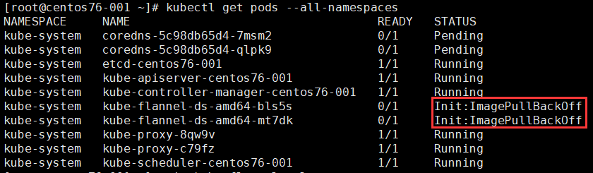
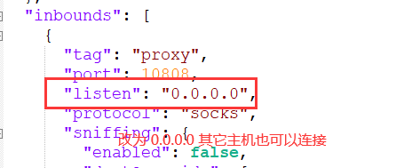
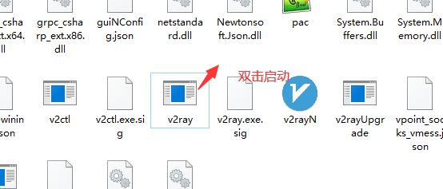
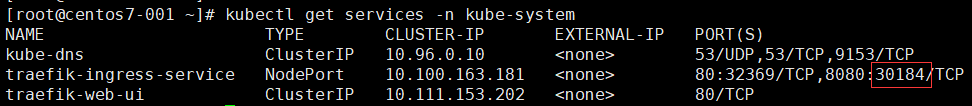
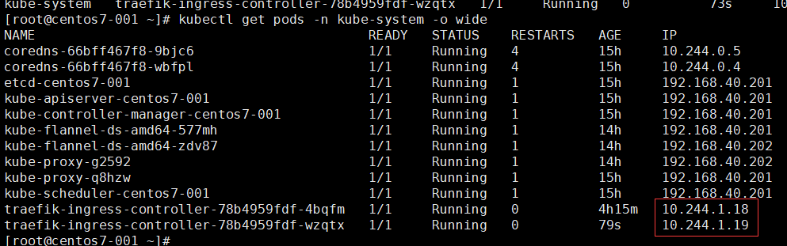
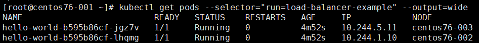
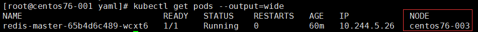
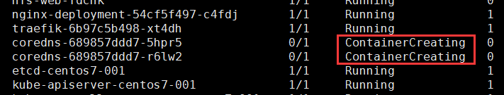
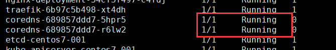
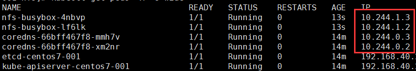

#### 在 CentOS 7 上部署 Kubernetes 集群 (国内网)

##### 1、服务器说明和配置

> master: 188.188.1.151
>
> worker1: 188.188.1.152
>
> worker2: 188.188.1.153

在 hosts 文件中添加主机名解析

```
188.188.1.151	centos76-001
188.188.1.152	centos76-002
188.188.1.153	centos76-003
```

##### 2、在 master 和 worker 上安装 docker

```
# Install Docker CE
## Set up the repository
### Install required packages.
yum install yum-utils device-mapper-persistent-data lvm2

### Add Docker repository.
yum-config-manager \
  --add-repo \
  https://download.docker.com/linux/centos/docker-ce.repo

## Install Docker CE.
yum update && yum install docker-ce-18.06.2.ce

## Create /etc/docker directory.
mkdir /etc/docker

# Setup daemon.
cat > /etc/docker/daemon.json <<EOF
{
  "exec-opts": ["native.cgroupdriver=systemd"],
  "log-driver": "json-file",
  "log-opts": {
    "max-size": "100m"
  },
  "storage-driver": "overlay2",
  "storage-opts": [
    "overlay2.override_kernel_check=true"
  ]
}
EOF

mkdir -p /etc/systemd/system/docker.service.d

# Restart Docker
systemctl daemon-reload
systemctl enable docker
systemctl restart docker
```

##### 3、在 master 和 worker 上安装 kubernetes

```
# cat /etc/yum.repos.d/kubernetes.repo
[kubernetes]
name=Kubernetes
baseurl=http://mirrors.aliyun.com/kubernetes/yum/repos/kubernetes-el7-x86_64
enabled=1
gpgcheck=0
repo_gpgcheck=0
gpgkey=http://mirrors.aliyun.com/kubernetes/yum/doc/yum-key.gpg
       http://mirrors.aliyun.com/kubernetes/yum/doc/rpm-package-key.gpg

# yum install -y kubelet kubeadm kubectl --disableexcludes=kubernetes
# systemctl enable kubelet
# systemctl start kubelet
```

##### 4、在 master 和 worker 上使用以下脚本 pull.sh 下载镜像

```
#!/bin/bash
for i in `kubeadm config images list`; do 
  imageName=${i#k8s.gcr.io/}
  docker pull registry.aliyuncs.com/google_containers/$imageName
  docker tag registry.aliyuncs.com/google_containers/$imageName k8s.gcr.io/$imageName
  docker rmi registry.aliyuncs.com/google_containers/$imageName
done
```

##### 5、在 master 上执行初始化

> --pod-network-cidr=10.244.0.0/16 参数指定是 **flannel** 网络的网段，用于 pods 直接的通信

```
kubeadm init --pod-network-cidr=10.244.0.0/16
```

##### 6、在 master 上安装 flannel 网络

```
wget https://raw.githubusercontent.com/coreos/flannel/62e44c867a2846fefb68bd5f178daf4da3095ccb/Documentation/kube-flannel.yml
kubectl apply -f kube-flannel.yml
kubectl get pods --all-namespaces # 如果 CoreDNS pod 是 up 和 running的，则安装成功
```

如果出现以下错误，则说明镜像下载失败，手动下载镜像看看是否能成功



##### 7、将 woker 添加到集群中

```
kubeadm join --token <token> <master-ip>:<master-port> --discovery-token-ca-cert-hash sha256:<hash>
```

##### 8、在 master 上查看节点

```
[root@centos76-001 ~]# kubectl get pods --all-namespaces 
NAMESPACE     NAME                                   READY   STATUS    RESTARTS   AGE
kube-system   coredns-5c98db65d4-7msm2               1/1     Running   0          51m
kube-system   coredns-5c98db65d4-qlpk9               1/1     Running   0          51m
kube-system   etcd-centos76-001                      1/1     Running   0          50m
kube-system   kube-apiserver-centos76-001            1/1     Running   0          50m
kube-system   kube-controller-manager-centos76-001   1/1     Running   0          50m
kube-system   kube-flannel-ds-amd64-bmhvr            1/1     Running   0          42m
kube-system   kube-flannel-ds-amd64-lm7hq            1/1     Running   0          73s
kube-system   kube-flannel-ds-amd64-wkwgs            1/1     Running   0          42m
kube-system   kube-proxy-8qw9v                       1/1     Running   0          47m
kube-system   kube-proxy-c79fz                       1/1     Running   0          51m
kube-system   kube-proxy-jjrtx                       1/1     Running   0          73s
kube-system   kube-scheduler-centos76-001            1/1     Running   0          50m
[root@centos76-001 ~]# kubectl get nodes
NAME           STATUS   ROLES    AGE   VERSION
centos76-001   Ready    master   52m   v1.15.3
centos76-002   Ready    <none>   47m   v1.15.3
centos76-003   Ready    <none>   80s   v1.15.3
```


#### 在 CentOS 7 上部署 Kubernetes 集群 (翻墙)

##### 准备翻墙环境

下载翻墙工具 [Chrome一键翻墙包](<http://d1.bdrive.tk/cg.7z>)

修改翻墙工具配置文件 D:\ChromeGo\v2rayB\config.json

> 以 v2ray 为例



启动



##### 在 CentOS 服务器上安装 Privoxy

> 只需在一台上安装，其它的可以通过该台代理

编译

```
wget http://www.privoxy.org/sf-download-mirror/Sources/3.0.28%20%28stable%29/privoxy-3.0.28-stable-src.tar.gz
tar -zxvf privoxy-3.0.28-stable-src.tar.gz
cd privoxy-3.0.28-stable
useradd privoxy
yum install autoconf automake libtool
autoheader && autoconf
./configure
make && make install
```

修改配置文件 /usr/local/etc/privoxy/config

> 192.168.1.10 为 CentOS 主机的 IP
>
> 192.168.1.8 为运行 v2ray 主机的 IP

```
listen-address  192.168.40.201:8118
forward-socks5t / 192.168.40.200:10808 .
```

启动

```
privoxy --user privoxy /usr/local/etc/privoxy/config
```

启用代理

```
export http_proxy=http://192.168.40.201:8118
export https_proxy=http://192.168.40.201:8118
export no_proxy=localhost,127.0.0.1,192.168.40.201
```

测试

```
curl -I www.google.com
```

##### 安装 docker

```
# 配置yum
yum install -y yum-utils
yum-config-manager --add-repo https://download.docker.com/linux/centos/docker-ce.repo
# 安装
yum install -y docker-ce docker-ce-cli containerd.io

## Create /etc/docker directory.
mkdir /etc/docker

# Setup daemon.
cat > /etc/docker/daemon.json <<EOF
{
  "exec-opts": ["native.cgroupdriver=systemd"],
  "log-driver": "json-file",
  "log-opts": {
    "max-size": "100m"
  },
  "storage-driver": "overlay2",
  "storage-opts": [
    "overlay2.override_kernel_check=true"
  ]
}
EOF

mkdir -p /etc/systemd/system/docker.service.d
systemctl start docker
systemctl enable docker
```

配置 docker 

> 镜像下载完后应还原

修改文件 /usr/lib/systemd/system/docker.service，添加 Environment

```
[Service]
Environment="HTTP_PROXY=http_proxy=http://192.168.40.201:8118" "HTTPS_PROXY=http://192.168.40.201:8118" "NO_PROXY=localhost,192.168.40.201,127.0.0.1,10.96.0.0/12,192.168.99.0/24"
```

重启 docker

```
systemctl daemon-reload
systemctl restart docker
```

##### 部署 k8s

安装 kubeadm、kubelet 和 kubectl

> worker 不需要安装 kubectl

```
# 配置yum，完成安装后删除
cat <<EOF > /etc/yum.repos.d/kubernetes.repo
[kubernetes]
name=Kubernetes
baseurl=https://packages.cloud.google.com/yum/repos/kubernetes-el7-x86_64
enabled=1
gpgcheck=1
repo_gpgcheck=1
gpgkey=https://packages.cloud.google.com/yum/doc/yum-key.gpg https://packages.cloud.google.com/yum/doc/rpm-package-key.gpg
EOF
# 安装
update-alternatives --set iptables /usr/sbin/iptables-legacy
yum install -y kubelet kubeadm kubectl --disableexcludes=kubernetes
systemctl enable kubelet
mv /etc/yum.repos.d/kubernetes.repo /tmp
```

在启用翻墙的终端拉取镜像

> worker 节点需要的镜像: 
>
> k8s.gcr.io/kube-proxy:v1.18.5
>
> k8s.gcr.io/pause:3.2 
>
> k8s.gcr.io/coredns:1.6.7

```
kubeadm config images pull
```

注释 /usr/lib/systemd/system/docker.service 文件的 Environment

```
# Environment="HTTP_PROXY=http_proxy=http://192.168.40.201:8118" "HTTPS_PROXY=http://192.168.40.201:8118" "NO_PROXY=localhost,192.168.40.201,127.0.0.1,10.96.0.0/12,192.168.99.0/24"
```

重启 docker

```
systemctl daemon-reload
systemctl restart docker
```

修改 /etc/sysctl.d/99-sysctl.conf, 添加一下内容

```
net.ipv4.ip_forward = 1
net.bridge.bridge-nf-call-ip6tables = 1
net.bridge.bridge-nf-call-iptables = 1
```

设置主机名解析

```
192.168.1.10  centos7-001
192.168.1.11  centos7-002
192.168.1.12  centos7-003
```

关闭 swap，需要重启服务器

```
[root@centos7-002 ~]# cat /etc/fstab 
...
# /dev/mapper/centos-swap swap                    swap    defaults        0 0
```

在新终端初始化 master

> --kubernetes-version=1.18.5 指定安装版本

```
kubeadm init --pod-network-cidr=10.244.0.0/16 --kubernetes-version=1.18.5
```

配置网络

> 使用的镜像 quay.io/coreos/flannel:v0.12.0-amd64，为了加快速度可以提前准备

```
kubectl apply -f https://raw.githubusercontent.com/coreos/flannel/master/Documentation/kube-flannel.yml
```

测试运行是否正常

> coredns,flannel 都为 running，则正常

```
[root@centos7-001 ~]# kubectl get pods -n kube-system
NAME                                  READY   STATUS    RESTARTS   AGE
coredns-66bff467f8-9bjc6              1/1     Running   0          157m
coredns-66bff467f8-wbfpl              1/1     Running   0          157m
etcd-centos7-001                      1/1     Running   0          157m
kube-apiserver-centos7-001            1/1     Running   0          157m
kube-controller-manager-centos7-001   1/1     Running   0          157m
kube-flannel-ds-amd64-577mh           1/1     Running   0          151m
kube-flannel-ds-amd64-zdv87           1/1     Running   0          92m
kube-proxy-g2592                      1/1     Running   0          92m
kube-proxy-q8hzw                      1/1     Running   0          157m
kube-scheduler-centos7-001            1/1     Running   0          157m
```

节点加入

```
# 显示加入节点命令
kubeadm token create --print-join-command
# 加入节点
kubeadm join 192.168.40.201:6443 --token qqe25f.8l45ojbosy9hxpkc     --discovery-token-ca-cert-hash sha256:84a8f25f211461cfe9c33243445e1d31d0cb81944728c44804d806a022cc01fe
```

查看节点

```
[root@centos7-001 ~]# kubectl get nodes
NAME          STATUS   ROLES    AGE   VERSION
centos7-001   Ready    master   43h   v1.18.5
centos7-002   Ready    <none>   42h   v1.18.5
centos7-003   Ready    <none>   85m   v1.18.6
```


##### 部署 traefix ingress

创建 traefik-rbac.yaml 文件

```
---
kind: ClusterRole
apiVersion: rbac.authorization.k8s.io/v1beta1
metadata:
  name: traefik-ingress-controller
rules:
  - apiGroups:
      - ""
    resources:
      - services
      - endpoints
      - secrets
    verbs:
      - get
      - list
      - watch
  - apiGroups:
      - extensions
    resources:
      - ingresses
    verbs:
      - get
      - list
      - watch
  - apiGroups:
    - extensions
    resources:
    - ingresses/status
    verbs:
    - update
---
kind: ClusterRoleBinding
apiVersion: rbac.authorization.k8s.io/v1beta1
metadata:
  name: traefik-ingress-controller
roleRef:
  apiGroup: rbac.authorization.k8s.io
  kind: ClusterRole
  name: traefik-ingress-controller
subjects:
- kind: ServiceAccount
  name: traefik-ingress-controller
  namespace: kube-system
```

应用

```
kubectl apply -f traefik-rbac.yaml
或
kubectl apply -f https://raw.githubusercontent.com/containous/traefik/v1.7/examples/k8s/traefik-rbac.yaml
```

创建 traefik-deployment.yaml 文件

```
---
apiVersion: v1
kind: ServiceAccount
metadata:
  name: traefik-ingress-controller
  namespace: kube-system
---
kind: Deployment
apiVersion: apps/v1
metadata:
  name: traefik-ingress-controller
  namespace: kube-system
  labels:
    k8s-app: traefik-ingress-lb
spec:
  replicas: 2
  selector:
    matchLabels:
      k8s-app: traefik-ingress-lb
  template:
    metadata:
      labels:
        k8s-app: traefik-ingress-lb
        name: traefik-ingress-lb
    spec:
      serviceAccountName: traefik-ingress-controller
      terminationGracePeriodSeconds: 60
      containers:
      - image: traefik:v1.7
        name: traefik-ingress-lb
        ports:
        - name: http
          containerPort: 80
        - name: admin
          containerPort: 8080
        args:
        - --api
        - --kubernetes
        - --logLevel=INFO
---
kind: Service
apiVersion: v1
metadata:
  name: traefik-ingress-service
  namespace: kube-system
spec:
  selector:
    k8s-app: traefik-ingress-lb
  ports:
    - protocol: TCP
      port: 80
      name: web
    - protocol: TCP
      port: 8080
      name: admin
  type: NodePort
```

应用

```
kubectl apply -f traefik-deployment.yaml
或
kubectl apply -f https://raw.githubusercontent.com/containous/traefik/v1.7/examples/k8s/traefik-deployment.yaml
```

查看访问 traefix 的 web ui 的 nodeport 



使用地址 http://nodeip:30184 访问 web ui

创建 ui.yaml 文件，实现通过 ingress 的方式访问 web ui

```
apiVersion: v1
kind: Service
metadata:
  name: traefik-web-ui
  namespace: kube-system
spec:
  selector:
    k8s-app: traefik-ingress-lb
  ports:
  - name: web
    port: 80
    targetPort: 8080
---
apiVersion: extensions/v1beta1
kind: Ingress
metadata:
  name: traefik-web-ui
  namespace: kube-system
spec:
  rules:
  - host: traefik.web.ui
    http:
      paths:
      - path: /
        backend:
          serviceName: traefik-web-ui
          servicePort: web
```

应用

```
kubectl apply -f ui.yaml
或
kubectl apply -f https://raw.githubusercontent.com/containous/traefik/v1.7/examples/k8s/ui.yaml
```

查看 traefix pod 的 ip 地址



在 master 节点(node 节点也可以)安装一个 nginx , server 配置如下

```
upstream traefix {
    server 10.244.1.18;
    server 10.244.1.19;
}

server {
    listen       80;
    server_name  traefik.web.ui;

    location / {
        proxy_pass	http://traefix;
        proxy_redirect          off;
        proxy_set_header    	Host             $host;
        proxy_set_header        X-Real-IP        $remote_addr;
        proxy_set_header        X-Forwarded-For  $proxy_add_x_forwarded_for;
    }
}
```

在主机 hosts 文件添加一条记录 192.168.40.201 traefik.web.ui ，使用 http://traefik.web.ui 访问 web ui

参考文档：https://docs.traefik.io/v1.7/user-guide/kubernetes/

 

#### 教程

##### 集群

查看集群

```
kubectl cluster-info
```

查看节点

```
kubectl get nodes
```

##### 创建 deployment

发布应用

```
kubectl create deployment kubernetes-bootcamp --image=gcr.io/google-samples/kubernetes-bootcamp:v1
```

查看

```
kubectl get deployments
```

启动代理

```
kubectl proxy
```

测试

```
curl http://localhost:8001/version
```

查看 pod 名字

```
export POD_NAME=$(kubectl get pods -o go-template --template '{{range .items}}{{.metadata.name}}{{"\n"}}{{end}}')
echo Name of the Pod: $POD_NAME
```


#### 了解应用

查看 pod 详情

```
kubectl describe pods
```

查看 pod 日志

```
kubectl logs kubernetes-bootcamp-6f6656d949-gsjj5
```

在 pod 中执行命令

```
kubectl exec kubernetes-bootcamp-6f6656d949-gsjj5 env
```

登录 pod

```
kubectl exec -it kubernetes-bootcamp-6f6656d949-gsjj5 -- bash
```

##### 暴露应用

查看 deployments

```
kubectl get deployments
```

查看服务

```
kubectl get services
```

创建服务

```
kubectl expose deployment/kubernetes-bootcamp --type="NodePort" --port 8080
```

查看服务详情

```
kubectl describe services/kubernetes-bootcamp
```

查看 NODE_PORT

```
export NODE_PORT=$(kubectl get services/kubernetes-bootcamp -o go-template='{{(index .spec.ports 0).nodePort}}')
echo NODE_PORT=$NODE_PORT
```

访问服务

```
curl http://NODE_IP:NODE_PORT
```


#### 部署应用程序

##### 部署使用服务访问的应用程序

>**目标** 
>
>- 运行Hello World应用程序的两个实例。
>- 创建一个公开节点端口的Service对象。
>- 使用Service对象访问正在运行的应用程序。

1、创建文件 hello-application.yaml

```
apiVersion: apps/v1
kind: Deployment
metadata:
  name: hello-world
spec:
  selector:
    matchLabels:
      run: load-balancer-example
  replicas: 2
  template:
    metadata:
      labels:
        run: load-balancer-example
    spec:
      containers:
        - name: hello-world
          image: nginx
          ports:
            - containerPort: 80
              protocol: TCP
```

2、部署应用程序

```
kubectl apply -f hello-application.yaml 
```

3、显示部署信息

```
kubectl get deployments hello-world
kubectl describe deployments hello-world
```

4、显示 ReplicaSet 信息

```
kubectl get replicasets
kubectl describe replicasets
```

5、创建公开部署的Service对象

```
kubectl expose deployment hello-world --type=NodePort --name=example-service
```

6、显示服务信息

```
# kubectl describe services example-service
Name:                     example-service
Namespace:                default
Labels:                   <none>
Annotations:              <none>
Selector:                 run=load-balancer-example
Type:                     NodePort
IP:                       10.99.118.198
Port:                     <unset>  80/TCP
TargetPort:               80/TCP
NodePort:                 <unset>  31826/TCP
Endpoints:                10.244.1.10:80,10.244.5.11:80
Session Affinity:         None
External Traffic Policy:  Cluster
Events:                   <none>
```

7、显示 pods 信息

```
kubectl get pods --selector="run=load-balancer-example" --output=wide
```



8、通过 node ip 访问集群

```
# curl -I http://188.188.1.152:31826
HTTP/1.1 200 OK
Server: nginx/1.17.3
Date: Wed, 28 Aug 2019 10:43:48 GMT
Content-Type: text/html
Content-Length: 612
Last-Modified: Tue, 13 Aug 2019 08:50:00 GMT
Connection: keep-alive
ETag: "5d5279b8-264"
Accept-Ranges: bytes
```

##### 部署指定节点和 NodePort 的应用

> nodeName 指定节点，nodePort 指定节点端口，type 指定服务类型，默认为 ClusterIP

创建部署 yaml 文件 redis-master-deployment.yaml 

```
apiVersion: apps/v1 # for versions before 1.9.0 use apps/v1beta2
kind: Deployment
metadata:
  name: redis-master
  labels:
    app: redis
spec:
  selector:
    matchLabels:
      app: redis
      role: master
      tier: backend
  replicas: 1
  template:
    metadata:
      labels:
        app: redis
        role: master
        tier: backend
    spec:
      nodeName: centos76-003
      containers:
      - name: master
        image: redis  # or just image: redis
        resources:
          requests:
            cpu: 100m
            memory: 100Mi
        ports:
        - containerPort: 6379
```

创建服务 yaml 文件 redis-master-service.yaml 

```
apiVersion: v1
kind: Service
metadata:
  name: redis-master
  labels:
    app: redis
    role: master
    tier: backend
spec:
  ports:
  - port: 6379
    targetPort: 6379
    nodePort: 30001
  selector:
    app: redis
    role: master
    tier: backend
  type: NodePort
```

应用 yaml 文件

```
kubectl apply -f redis-master-deployment.yaml
kubectl apply -f redis-master-service.yaml 
```

查看 pod 信息

```
kubectl get pods --output=wide
```



查看服务信息

```
# kubectl get service redis-master
NAME           TYPE       CLUSTER-IP       EXTERNAL-IP   PORT(S)          AGE
redis-master   NodePort   10.102.248.122   <none>        6379:30001/TCP   18m
```

测试登陆 redis

```
# redis-cli -h centos76-003 -p 30001
centos76-003:30001> set k 123456
OK
centos76-003:30001> get k
"123456"
```

##### 部署挂载 NODE 目录的应用

```
apiVersion: v1
kind: Pod
metadata:
  name: vol-emptydir-pod
spec:
  volumes:
  - name: html
    # emptyDir: { }
    hostPath:
      path: /tmp/html
      type: DirectoryOrCreate
  containers:
  - name: nginx
    image: nginx:latest
    volumeMounts:
    - name: html
      mountPath: /usr/share/nginx/html
  - name: pagegen
    image: alpine
    volumeMounts:
    - name: html
      mountPath: /html
    command: [ "/bin/sh", "-c" ]
    args:                        #定义循环，每10秒向/html/文件中追加写入当前主机名和时间
    - while true; do
        echo $(hostname) $(date) >> /html/index.html;
        sleep 10;
      done
```

##### 部署挂载 NFS 目录的应用

> 一个 pv 对应 一个 pvc
>
> 如果存在多个可用的 pv，创建 pvc 时会自动选择 pc

```
# This mounts the nfs volume claim into /mnt and continuously
# overwrites /mnt/index.html with the time and hostname of the pod.
---
apiVersion: v1
kind: PersistentVolume
metadata:
  name: project-a-pv
spec:
  capacity:
    storage: 10Gi
  accessModes:
    - ReadWriteMany
  nfs:
    server: 192.168.1.10
    path: "/nfsdisk"
---
apiVersion: v1
kind: PersistentVolumeClaim
metadata:
  name: project-a-pvc
spec:
  accessModes:
    - ReadWriteMany
  storageClassName: ""
  resources:
    requests:
      storage: 10Gi
---
apiVersion: v1
kind: ReplicationController
metadata:
  name: nfs-busybox
spec:
  replicas: 2
  selector:
    name: nfs-busybox
  template:
    metadata:
      labels:
        name: nfs-busybox
    spec:
      containers:
      - image: busybox
        command:
          - sh
          - -c
          - 'while true; do echo `date`:`hostname` >> /mnt/index.html; sleep 1s; done'
        imagePullPolicy: IfNotPresent
        name: busybox
        volumeMounts:
          # name must match the volume name below
          - name: html
            mountPath: "/mnt"
      volumes:
      - name: html
        persistentVolumeClaim:
          claimName: project-a-pvc
```

##### 部署 redes 服务(deployment + service)

redis-service.yaml 文件

```
---
kind: Deployment
apiVersion: apps/v1
metadata:
  name: redis
  labels:
    k8s-app: redis
spec:
  replicas: 1
  selector:
    matchLabels:
      k8s-app: redis
  template:
    metadata:
      labels:
        k8s-app: redis
    spec:
      containers:
      - image: redis
        imagePullPolicy: IfNotPresent
        name: app
        ports:
          - containerPort: 6379
---
kind: Service
apiVersion: v1
metadata:
  name: redis
spec:
  ports:
    - port: 6379
  selector:
    k8s-app: redis
```

应用

```
kubectl apply -f redis-service.yaml
```

##### 部署 flask 应用(deployment + service + ingress)

程序文件 app.py

```
import time
from datetime import datetime
import redis
import socket
from flask import Flask

app = Flask(__name__)
cache = redis.Redis(host='redis', port=6379)


def get_hit_count():
    retries = 5
    while True:
        try:
            return cache.incr('hits')
        except redis.exceptions.ConnectionError as exc:
            if retries == 0:
                raise exc
            retries -= 1
            time.sleep(0.5)


@app.route('/')
def hello():
    count = get_hit_count()
    hn = socket.gethostname()
    dt = datetime.now()
    hl='Hello World! I have been seen {} times.'.format(count)
    return '主机名:%s 时间:%s 内容:%s' % (hn,dt,hl)
```

dockfile 文件 flask-base-dockerfile

```
FROM python:3.7-alpine
WORKDIR /code
RUN apk add --no-cache gcc musl-dev linux-headers
RUN pip install flask redis
ENV FLASK_APP app.py
ENV FLASK_RUN_HOST 0.0.0.0
COPY app.py .
CMD ["flask", "run"]
```

生成 docker 镜像

```
docker build -t flask:v1.0 -f flask-dockerfile .
```

k8s yaml 文件 flask.yaml

```
---
kind: Deployment
apiVersion: apps/v1
metadata:
  name: flask
  labels:
    k8s-app: flask
spec:
  replicas: 2
  selector:
    matchLabels:
      k8s-app: flask
  template:
    metadata:
      labels:
        k8s-app: flask
    spec:
      containers:
      - image: flask:v1.0
        imagePullPolicy: IfNotPresent
        name: flask
        ports:
          - containerPort: 5000
---
kind: Service
apiVersion: v1
metadata:
  name: flask
spec:
  ports:
    - name: web
      port: 5000
  selector:
    k8s-app: flask
---
apiVersion: extensions/v1beta1
kind: Ingress
metadata:
  name: flask-ingress
spec:
  rules:
  - host: flask.web.ingress
    http:
      paths:
      - path: /
        backend:
          serviceName: flask
          servicePort: web

```

应用

```
kubectl apply -f flask.yaml
```

查看 traefix pod 的 ip 地址


在 master 节点(node 节点也可以)安装一个 nginx , server 配置如下

```
upstream traefix {
    server 10.244.1.18;
    server 10.244.1.19;
}

server {
    listen       80;
    server_name  flask.web.ingress;

    location / {
        proxy_pass	http://traefix;
        proxy_redirect          off;
        proxy_set_header    	Host             $host;
        proxy_set_header        X-Real-IP        $remote_addr;
        proxy_set_header        X-Forwarded-For  $proxy_add_x_forwarded_for;
    }
}
```

在主机 hosts 文件添加一条记录 "192.168.40.201 traefik.web.ui" ，使用 http://flask.web.ingress 访问 flask

##### 部署使用阿里云镜像的应用

> 虽然 docker login 后可以通过 docker pull 命令拉取镜像, 但无法通过k8s创建pod方式拉取

生成密钥

```
kubectl create secret docker-registry aliyun --docker-server=registry.cn-shenzhen.aliyuncs.com --docker-username=胡海青2020 --docker-password=******
```

查看生成的密钥

```
[root@centos7-001 ~]# kubectl get secret
NAME                  TYPE                                  DATA   AGE
aliyun                kubernetes.io/dockerconfigjson        1      14m
default-token-8qr67   kubernetes.io/service-account-token   3      43h
```

在 yaml 文件中指定 imagePullSecrets

```
kind: Deployment
apiVersion: apps/v1
metadata:
  name: flask
  labels:
    k8s-app: flask
spec:
  replicas: 4
  selector:
    matchLabels:
      k8s-app: flask
  template:
    metadata:
      labels:
        k8s-app: flask
    spec:
      containers:
      - image: registry.cn-shenzhen.aliyuncs.com/nsa/flask:v2.9
        imagePullPolicy: IfNotPresent
        name: flask
        ports:
          - containerPort: 5000
      imagePullSecrets:
      - name: aliyun
```


#### 资料

**Kubernet**

- [Kubernetes中文指南/云原生应用架构实践手册](<https://jimmysong.io/kubernetes-handbook/>)

**Docker**

- [Docker Handbook](<https://jimmysong.io/docker-handbook/>)


#### 常用命令

通过 pod 登陆容器

```
# kubectl get pods
NAME                                READY   STATUS    RESTARTS   AGE
mysql-7d7fdd478f-vvtfw              1/1     Running   0          5h18m
nginx-deployment-6f655f5d99-2twx8   1/1     Running   0          5h32m
nginx-deployment-6f655f5d99-rgmvs   1/1     Running   0          5h32m
# kubectl exec -it mysql-7d7fdd478f-vvtfw -- /bin/bash
root@mysql-7d7fdd478f-vvtfw:/# 
```

查看 pod 日志

```
kubectl logs podname
```

登录到 pod 容器中

```
kubectl exec POD_NAME -c CONTAINER_NAME -it -- sh
```

重新生成 token, 并打印加入 master 命令

```
kubeadm token create --print-join-command
```


#### 安装 heml

下载

```
wget https://get.helm.sh/helm-v3.3.0-rc.1-linux-amd64.tar.gz
```

安装

```
tar zxvf helm-v3.3.0-rc.1-linux-amd64.tar.gz
mv linux-amd64/helm /usr/local/bin/
chmod +x /usr/local/bin/helm
```

检查版本

```
helm version
```


#### 常见问题

##### coredns 无法启动

/var/log/message 日志报一下错误

```
Jul 10 16:28:19 centos7-001 kubelet: W0710 16:28:19.505758   16742 cni.go:331] CNI failed to retrieve network namespace path: cannot find network namespace for the terminated container "77dc0fbb3f9f1e9c1f017ced6748dbba08e374cc3b46832d87d8d4632153fb15"
Jul 10 16:28:19 centos7-001 kubelet: E0710 16:28:19.585270   16742 cni.go:385] Error deleting kube-system_coredns-689857ddd7-r6lw2/77dc0fbb3f9f1e9c1f017ced6748dbba08e374cc3b46832d87d8d4632153fb15 from network calico/k8s-pod-network: error getting ClusterInformation: Get https://[10.96.0.1]:443/apis/crd.projectcalico.org/v1/clusterinformations/default: x509: certificate signed by unknown authority (possibly because of "crypto/rsa: verification error" while trying to verify candidate authority certificate "kubernetes")
Jul 10 16:28:19 centos7-001 kubelet: E0710 16:28:19.586460   16742 remote_runtime.go:128] StopPodSandbox "77dc0fbb3f9f1e9c1f017ced6748dbba08e374cc3b46832d87d8d4632153fb15" from runtime service failed: rpc error: code = Unknown desc = networkPlugin cni failed to teardown pod "coredns-689857ddd7-r6lw2_kube-system" network: error getting ClusterInformation: Get https://[10.96.0.1]:443/apis/crd.projectcalico.org/v1/clusterinformations/default: x509: certificate signed by unknown authority (possibly because of "crypto/rsa: verification error" while trying to verify candidate authority certificate "kubernetes")
```

coredns pod 的状态



处理方法

```
mv /etc/cni/net.d/10-calico.conflist /tmp/
mv /etc/cni/net.d/calico-kubeconfig /tmp/
```

再次检查状态，运行正常




##### coredns ip 无法 ping 通

检查 pod 发现不在同一个子网



##### 无法使用本地镜像

因为imagePullPolicy 为“Always”（默认值），修改为“ifNotPresent”即可解决此问题

```
containers:
- image: app-nginx:latest
  imagePullPolicy: IfNotPresent
  name: app
  ports:
  - containerPort: 80
```

