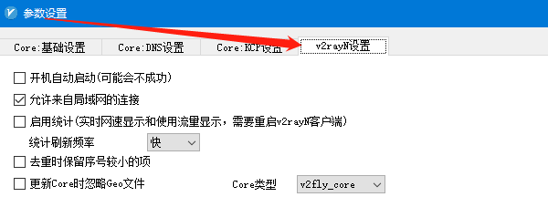
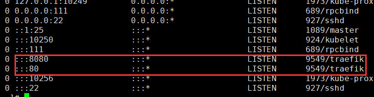
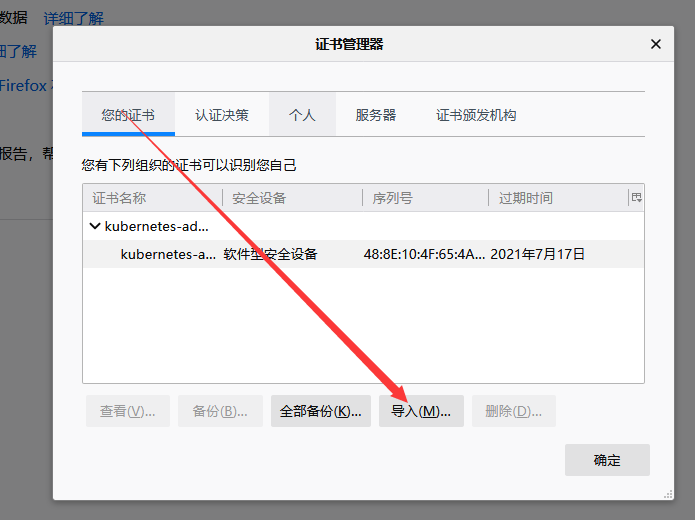
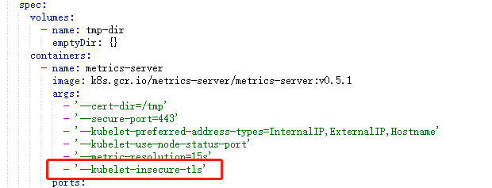
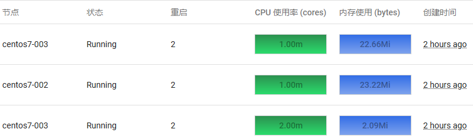

#### 在 CentOS 7 上部署 Kubernetes 集群 (国内网)

##### 1、服务器说明和配置

> master: 188.188.1.151
>
> worker1: 188.188.1.152
>
> worker2: 188.188.1.153

在 hosts 文件中添加主机名解析

```
188.188.1.151	centos76-001
188.188.1.152	centos76-002
188.188.1.153	centos76-003
```

##### 2、在 master 和 worker 上安装 docker

```
# Install Docker CE
## Set up the repository
### Install required packages.
yum install yum-utils device-mapper-persistent-data lvm2

### Add Docker repository.
yum-config-manager \
  --add-repo \
  https://download.docker.com/linux/centos/docker-ce.repo

## Install Docker CE.
yum update && yum install docker-ce-18.06.2.ce

## Create /etc/docker directory.
mkdir /etc/docker

# Setup daemon.
cat > /etc/docker/daemon.json <<EOF
{
  "exec-opts": ["native.cgroupdriver=systemd"],
  "log-driver": "json-file",
  "log-opts": {
    "max-size": "100m"
  },
  "storage-driver": "overlay2",
  "storage-opts": [
    "overlay2.override_kernel_check=true"
  ]
}
EOF

mkdir -p /etc/systemd/system/docker.service.d

# Restart Docker
systemctl daemon-reload
systemctl enable docker
systemctl restart docker
```

##### 3、在 master 和 worker 上安装 kubernetes

```
# cat /etc/yum.repos.d/kubernetes.repo
[kubernetes]
name=Kubernetes
baseurl=http://mirrors.aliyun.com/kubernetes/yum/repos/kubernetes-el7-x86_64
enabled=1
gpgcheck=0
repo_gpgcheck=0
gpgkey=http://mirrors.aliyun.com/kubernetes/yum/doc/yum-key.gpg
       http://mirrors.aliyun.com/kubernetes/yum/doc/rpm-package-key.gpg

# yum install -y kubelet kubeadm kubectl --disableexcludes=kubernetes
# systemctl enable kubelet
# systemctl start kubelet
```

##### 4、在 master 和 worker 上使用以下脚本 pull.sh 下载镜像

```
#!/bin/bash
for i in `kubeadm config images list`; do 
  imageName=${i#k8s.gcr.io/}
  docker pull registry.aliyuncs.com/google_containers/$imageName
  docker tag registry.aliyuncs.com/google_containers/$imageName k8s.gcr.io/$imageName
  docker rmi registry.aliyuncs.com/google_containers/$imageName
done
```

##### 5、在 master 上执行初始化

> --pod-network-cidr=10.244.0.0/16 参数指定是 **flannel** 网络的网段，用于 pods 直接的通信

```
kubeadm init --pod-network-cidr=10.244.0.0/16
```

##### 6、在 master 上安装 flannel 网络

```
wget https://raw.githubusercontent.com/coreos/flannel/62e44c867a2846fefb68bd5f178daf4da3095ccb/Documentation/kube-flannel.yml
kubectl apply -f kube-flannel.yml
kubectl get pods --all-namespaces # 如果 CoreDNS pod 是 up 和 running的，则安装成功
```

如果出现以下错误，则说明镜像下载失败，手动下载镜像看看是否能成功


##### 7、将 woker 添加到集群中

```
kubeadm join --token <token> <master-ip>:<master-port> --discovery-token-ca-cert-hash sha256:<hash>
```

##### 8、在 master 上查看节点

```
[root@centos76-001 ~]# kubectl get pods --all-namespaces 
NAMESPACE     NAME                                   READY   STATUS    RESTARTS   AGE
kube-system   coredns-5c98db65d4-7msm2               1/1     Running   0          51m
kube-system   coredns-5c98db65d4-qlpk9               1/1     Running   0          51m
kube-system   etcd-centos76-001                      1/1     Running   0          50m
kube-system   kube-apiserver-centos76-001            1/1     Running   0          50m
kube-system   kube-controller-manager-centos76-001   1/1     Running   0          50m
kube-system   kube-flannel-ds-amd64-bmhvr            1/1     Running   0          42m
kube-system   kube-flannel-ds-amd64-lm7hq            1/1     Running   0          73s
kube-system   kube-flannel-ds-amd64-wkwgs            1/1     Running   0          42m
kube-system   kube-proxy-8qw9v                       1/1     Running   0          47m
kube-system   kube-proxy-c79fz                       1/1     Running   0          51m
kube-system   kube-proxy-jjrtx                       1/1     Running   0          73s
kube-system   kube-scheduler-centos76-001            1/1     Running   0          50m
[root@centos76-001 ~]# kubectl get nodes
NAME           STATUS   ROLES    AGE   VERSION
centos76-001   Ready    master   52m   v1.15.3
centos76-002   Ready    <none>   47m   v1.15.3
centos76-003   Ready    <none>   80s   v1.15.3
```


#### 在 CentOS 7 上部署 Kubernetes 集群 (翻墙)

##### 准备翻墙环境

在本地 windows 电脑上开启 v2rayN 允许局域网的连接

> 重新打开后，需要重新开启

 

在 master, node 上设置代理

```
export http_proxy=socks5://192.168.40.200:10808
export https_proxy=socks5://192.168.40.200:10808
export no_proxy=localhost,127.0.0.1,192.168.40.200
```

##### 安装 docker

```
# 配置yum
yum install -y yum-utils
yum-config-manager --add-repo https://download.docker.com/linux/centos/docker-ce.repo
# 安装
yum update && yum install -y docker-ce docker-ce-cli containerd.io

## Create /etc/docker directory.
mkdir /etc/docker

# Setup daemon.
cat > /etc/docker/daemon.json <<EOF
{
  "exec-opts": ["native.cgroupdriver=systemd"],
  "log-driver": "json-file",
  "log-opts": {
    "max-size": "100m"
  },
  "storage-driver": "overlay2",
  "storage-opts": [
    "overlay2.override_kernel_check=true"
  ]
}
EOF

mkdir -p /etc/systemd/system/docker.service.d
systemctl start docker
systemctl enable docker
```

配置 docker 

> 镜像下载完后应还原

修改文件 /usr/lib/systemd/system/docker.service，添加 Environment

```
[Service]
Environment="http_proxy=socks5://192.168.40.200:10808" "https_proxy=socks5://192.168.40.200:10808" "NO_PROXY=localhost,127.0.0.1,192.168.40.200"
```

重启 docker

```
systemctl daemon-reload
systemctl restart docker
```

##### 部署 k8s

安装 kubeadm、kubelet 和 kubectl

> worker 不需要安装 kubectl

```
# 配置yum，完成安装后删除
cat <<EOF > /etc/yum.repos.d/kubernetes.repo
[kubernetes]
name=Kubernetes
baseurl=https://packages.cloud.google.com/yum/repos/kubernetes-el7-x86_64
enabled=1
gpgcheck=1
repo_gpgcheck=1
gpgkey=https://packages.cloud.google.com/yum/doc/yum-key.gpg https://packages.cloud.google.com/yum/doc/rpm-package-key.gpg
EOF
# 安装
update-alternatives --set iptables /usr/sbin/iptables-legacy
yum install -y kubelet kubeadm kubectl --disableexcludes=kubernetes
systemctl enable kubelet
mv /etc/yum.repos.d/kubernetes.repo /tmp
```

在启用翻墙的终端拉取镜像

> worker 节点需要的镜像(具体版本和 master 一致): 
>
> k8s.gcr.io/kube-proxy:v1.18.5
>
> k8s.gcr.io/pause:3.2 
>
> k8s.gcr.io/coredns:1.6.7

```
kubeadm config images pull
```

注释 /usr/lib/systemd/system/docker.service 文件的 Environment

```
# Environment="HTTP_PROXY=http://192.168.40.201:8118" "HTTPS_PROXY=http://192.168.40.201:8118" "NO_PROXY=localhost,127.0.0.1,192.168.40.201"
```

重启 docker

```
systemctl daemon-reload
systemctl restart docker
```

修改 /etc/sysctl.d/99-sysctl.conf, 添加一下内容，并命令 sysctl -p 加载

```
net.bridge.bridge-nf-call-iptables = 1
```

设置主机名解析

```
192.168.1.10  centos7-001
192.168.1.11  centos7-002
192.168.1.12  centos7-003
```

关闭 swap，需要重启服务器

```
[root@centos7-002 ~]# cat /etc/fstab 
...
# /dev/mapper/centos-swap swap                    swap    defaults        0 0
```

在新终端初始化 master

> --kubernetes-version=1.18.5 指定安装版本

```
kubeadm init --pod-network-cidr=10.244.0.0/16 --kubernetes-version=1.18.5
```

要使非 root 用户可以运行 kubectl，请运行以下命令， 它们也是 `kubeadm init` 输出的一部分：

```bash
mkdir -p $HOME/.kube
sudo cp -i /etc/kubernetes/admin.conf $HOME/.kube/config
sudo chown $(id -u):$(id -g) $HOME/.kube/config
```

或者，如果你是 `root` 用户，则可以运行：

> 添加到 .bash_profile 文件中

```bash
export KUBECONFIG=/etc/kubernetes/admin.conf
```

配置网络

> 使用的镜像 quay.io/coreos/flannel:v0.12.0-amd64，为了加快速度可以提前准备

```
kubectl apply -f https://raw.githubusercontent.com/coreos/flannel/master/Documentation/kube-flannel.yml
```

测试运行是否正常

> coredns,flannel 都为 running，则正常

```
[root@centos7-001 ~]# kubectl get pods -n kube-system
NAME                                  READY   STATUS    RESTARTS   AGE
coredns-66bff467f8-9bjc6              1/1     Running   0          157m
coredns-66bff467f8-wbfpl              1/1     Running   0          157m
etcd-centos7-001                      1/1     Running   0          157m
kube-apiserver-centos7-001            1/1     Running   0          157m
kube-controller-manager-centos7-001   1/1     Running   0          157m
kube-flannel-ds-amd64-577mh           1/1     Running   0          151m
kube-flannel-ds-amd64-zdv87           1/1     Running   0          92m
kube-proxy-g2592                      1/1     Running   0          92m
kube-proxy-q8hzw                      1/1     Running   0          157m
kube-scheduler-centos7-001            1/1     Running   0          157m
```

节点加入

```
# 显示加入节点命令(在 master 执行)
kubeadm token create --print-join-command
# 加入节点(在 node 执行)
kubeadm join 192.168.40.201:6443 --token qqe25f.8l45ojbosy9hxpkc     --discovery-token-ca-cert-hash sha256:84a8f25f211461cfe9c33243445e1d31d0cb81944728c44804d806a022cc01fe
```

查看节点

```
[root@centos7-001 ~]# kubectl get nodes
NAME          STATUS   ROLES    AGE   VERSION
centos7-001   Ready    master   43h   v1.18.5
centos7-002   Ready    <none>   42h   v1.18.5
centos7-003   Ready    <none>   85m   v1.18.6
```


##### 部署 traefix ingress

创建 traefik-rbac.yaml 文件

```
---
kind: ClusterRole
apiVersion: rbac.authorization.k8s.io/v1beta1
metadata:
  name: traefik-ingress-controller
rules:
  - apiGroups:
      - ""
    resources:
      - services
      - endpoints
      - secrets
    verbs:
      - get
      - list
      - watch
  - apiGroups:
      - extensions
    resources:
      - ingresses
    verbs:
      - get
      - list
      - watch
  - apiGroups:
    - extensions
    resources:
    - ingresses/status
    verbs:
    - update
---
kind: ClusterRoleBinding
apiVersion: rbac.authorization.k8s.io/v1beta1
metadata:
  name: traefik-ingress-controller
roleRef:
  apiGroup: rbac.authorization.k8s.io
  kind: ClusterRole
  name: traefik-ingress-controller
subjects:
- kind: ServiceAccount
  name: traefik-ingress-controller
  namespace: kube-system
```

应用

```
kubectl apply -f traefik-rbac.yaml
或
kubectl apply -f https://raw.githubusercontent.com/containous/traefik/v1.7/examples/k8s/traefik-rbac.yaml
```

创建 traefik-deployment.yaml 文件

```
---
apiVersion: v1
kind: ServiceAccount
metadata:
  name: traefik-ingress-controller
  namespace: kube-system
---
kind: Deployment
apiVersion: apps/v1
metadata:
  name: traefik-ingress-controller
  namespace: kube-system
  labels:
    k8s-app: traefik-ingress-lb
spec:
  replicas: 2
  selector:
    matchLabels:
      k8s-app: traefik-ingress-lb
  template:
    metadata:
      labels:
        k8s-app: traefik-ingress-lb
        name: traefik-ingress-lb
    spec:
      serviceAccountName: traefik-ingress-controller
      terminationGracePeriodSeconds: 60
      containers:
      - image: traefik:v1.7
        name: traefik-ingress-lb
        ports:
        - name: http
          containerPort: 80
        - name: admin
          containerPort: 8080
        args:
        - --api
        - --kubernetes
        - --logLevel=INFO
---
kind: Service
apiVersion: v1
metadata:
  name: traefik-ingress-service
  namespace: kube-system
spec:
  selector:
    k8s-app: traefik-ingress-lb
  ports:
    - protocol: TCP
      port: 80
      name: web
    - protocol: TCP
      port: 8080
      name: admin
  type: NodePort
```

应用

```
kubectl apply -f traefik-deployment.yaml
或
kubectl apply -f https://raw.githubusercontent.com/containous/traefik/v1.7/examples/k8s/traefik-deployment.yaml
```

查看访问 traefix 的 web ui 的 nodeport 


使用地址 http://nodeip:30184 访问 web ui

创建 ui.yaml 文件，实现通过 ingress 的方式访问 web ui

```
apiVersion: v1
kind: Service
metadata:
  name: traefik-web-ui
  namespace: kube-system
spec:
  selector:
    k8s-app: traefik-ingress-lb
  ports:
  - name: web
    port: 80
    targetPort: 8080
---
apiVersion: extensions/v1beta1
kind: Ingress
metadata:
  name: traefik-web-ui
  namespace: kube-system
spec:
  rules:
  - host: traefik.myk8s.com
    http:
      paths:
      - path: /
        backend:
          serviceName: traefik-web-ui
          servicePort: web
```

应用

```
kubectl apply -f ui.yaml
或
kubectl apply -f https://raw.githubusercontent.com/containous/traefik/v1.7/examples/k8s/ui.yaml
```

查看 traefix services clusterip 地址


在 master 节点(node 节点也可以)安装一个 nginx , server 配置如下

```
upstream traefix {
    server 10.244.1.18;
    server 10.244.1.19;
}

server {
    listen       80;
    server_name  traefik.web.ui;

    location / {
        proxy_pass	http://traefix;
        proxy_redirect          off;
        proxy_set_header    	Host             $host;
        proxy_set_header        X-Real-IP        $remote_addr;
        proxy_set_header        X-Forwarded-For  $proxy_add_x_forwarded_for;
    }
}
```

在主机 hosts 文件添加一条记录 192.168.40.201 traefik.web.ui ，使用 http://traefik.web.ui 访问 web ui

参考文档：https://docs.traefik.io/v1.7/user-guide/kubernetes/

##### 部署边缘节点(trafix ingress)

创建 traefik-rbac.yaml 文件

```
---
kind: ClusterRole
apiVersion: rbac.authorization.k8s.io/v1beta1
metadata:
  name: traefik-ingress-controller
rules:
  - apiGroups:
      - ""
    resources:
      - services
      - endpoints
      - secrets
    verbs:
      - get
      - list
      - watch
  - apiGroups:
      - extensions
    resources:
      - ingresses
    verbs:
      - get
      - list
      - watch
  - apiGroups:
    - extensions
    resources:
    - ingresses/status
    verbs:
    - update
---
kind: ClusterRoleBinding
apiVersion: rbac.authorization.k8s.io/v1beta1
metadata:
  name: traefik-ingress-controller
roleRef:
  apiGroup: rbac.authorization.k8s.io
  kind: ClusterRole
  name: traefik-ingress-controller
subjects:
- kind: ServiceAccount
  name: traefik-ingress-controller
  namespace: kube-system
```

应用

```
kubectl apply -f traefik-rbac.yaml 或
kubectl apply -f https://raw.githubusercontent.com/containous/traefik/v1.7/examples/k8s/traefik-rbac.yaml
```

选择一个 node 标记为边缘节点

```
kubectl label nodes NODE_NAME edgenode=true
```

创建文件 traefik-ds.yaml

> 选择 DaemonSet 不用 Deployment 是因为 Deployment 更新时，会不停止旧的 pod 同时生成新的 pod ，这与 hostNetwork: true 产生冲突，hostNetwork: true 会将 80和8080 端口绑定到 node ip。
>
> nodeSelector: 选择部署在边缘服务器。如果有多台边缘主机可以使用 keepalived 实现高可用。

```
---
apiVersion: v1
kind: ServiceAccount
metadata:
  name: traefik-ingress-controller
  namespace: kube-system
---
kind: DaemonSet
apiVersion: apps/v1
metadata:
  name: traefik-ingress-controller
  namespace: kube-system
  labels:
    k8s-app: traefik-ingress-lb
spec:
  selector:
    matchLabels:
      k8s-app: traefik-ingress-lb
      name: traefik-ingress-lb
  template:
    metadata:
      labels:
        k8s-app: traefik-ingress-lb
        name: traefik-ingress-lb
    spec:
      serviceAccountName: traefik-ingress-controller
      terminationGracePeriodSeconds: 60
      hostNetwork: true
      containers:
      - image: traefik:v1.7
        name: traefik-ingress-lb
        ports:
        - name: http
          containerPort: 80
          hostPort: 80
        - name: https
          containerPort: 443
          hostPort: 443
        - name: admin
          containerPort: 8080
          hostPort: 8080
        securityContext:
          capabilities:
            drop:
            - ALL
            add:
            - NET_BIND_SERVICE
        args:
        - --api
        - --kubernetes
        - --logLevel=INFO
        - --defaultentrypoints=http,https
        - --entrypoints=Name:https Address::443 TLS
        - --entrypoints=Name:http Address::80
      nodeSelector:
        edgenode: "true"
```

应用

```
kubectl apply -f traefik-ds.yaml
```

80和8080端口绑定到了 node ip



创建 ui.yaml

```
apiVersion: v1
kind: Service
metadata:
  name: traefik-web-ui
  namespace: kube-system
spec:
  selector:
    k8s-app: traefik-ingress-lb
  ports:
  - name: web
    port: 80
    targetPort: 8080
---
apiVersion: extensions/v1beta1
kind: Ingress
metadata:
  name: traefik-web-ui
  namespace: kube-system
spec:
  rules:
  - host: traefix.myk8s.com
    http:
      paths:
      - path: /
        backend:
          serviceName: traefik-web-ui
          servicePort: web
```

在访问 traefik web ui 的主机添加一条将 traefix.myk8s.com 解析到 node ip 的记录，就可以直接使用地址 http://traefik.myk8s.com/dashboard/ 访问 traefix web ui

参考博文：

https://jimmysong.io/kubernetes-handbook/practice/edge-node-configuration.html

https://docs.traefik.io/v1.7/user-guide/kubernetes/

 ##### 部署 Dashboard UI

部署

```
kubectl apply -f https://raw.githubusercontent.com/kubernetes/dashboard/v2.0.0/aio/deploy/recommended.yaml
```

生成 client-certificate-data

```
grep 'client-certificate-data' ~/.kube/config | head -n 1 | awk '{print $2}' | base64 -d >> kubecfg.crt
```

生成 client-key-data

```
grep 'client-key-data' ~/.kube/config | head -n 1 | awk '{print $2}' | base64 -d >> kubecfg.key
```

生成p12

```
openssl pkcs12 -export -clcerts -inkey kubecfg.key -in kubecfg.crt -out kubecfg.p12 -name "kubernetes-client"
```

将 kubecfg.p12 导入到 firefox 浏览器



创建生成 token 的 yaml 文件 admin-role.yaml

```
kind: ClusterRoleBinding
apiVersion: rbac.authorization.k8s.io/v1beta1
metadata:
  name: admin
  annotations:
    rbac.authorization.kubernetes.io/autoupdate: "true"
roleRef:
  kind: ClusterRole
  name: cluster-admin
  apiGroup: rbac.authorization.k8s.io
subjects:
- kind: ServiceAccount
  name: admin
  namespace: kube-system
---
apiVersion: v1
kind: ServiceAccount
metadata:
  name: admin
  namespace: kube-system
  labels:
    kubernetes.io/cluster-service: "true"
    addonmanager.kubernetes.io/mode: Reconcile
```

应用

```bash
kubectl create -f admin-role.yaml
```

获取 admin-token 的secret名字

```
kubectl -n kube-system get secret | grep admin-token
```

获取 token 的值

```
kubectl -n kube-system describe secret admin-token-bdt8h
```

使用地址 https://192.168.40.201:6443/api/v1/namespaces/kubernetes-dashboard/services/https:kubernetes-dashboard:/proxy/ 登录 

参考文档：

https://jimmysong.io/kubernetes-handbook/guide/auth-with-kubeconfig-or-token.html

https://www.cnblogs.com/rainingnight/p/deploying-k8s-dashboard-ui.html

https://kubernetes.io/zh/docs/tasks/access-application-cluster/web-ui-dashboard/

##### 部署 metrics-server

执行部署

```
kubectl apply -f https://github.com/kubernetes-sigs/metrics-server/releases/latest/download/components.yaml
```

修改 deployment 第一处，添加 `--kubelet-insecure-tls`



等待1分钟左右，检测

```
[root@centos7-001 ~]# kubectl top nodes
NAME          CPU(cores)   CPU%   MEMORY(bytes)   MEMORY%   
centos7-001   150m         7%     1539Mi          41%       
centos7-002   28m          2%     504Mi           57%       
centos7-003   24m          2%     496Mi           56% 
```

Dashboard 显示资源使用情况



参考文档：

[https://p1htmlkernalweb.mybluemix.net/articles/%E4%BC%81%E4%B8%9A%E7%BA%A7%E5%AE%B9%E5%99%A8%E6%8A%80%E6%9C%AF+k8s+%E8%B5%84%E6%BA%90%E7%9B%91%E6%8E%A7%E7%9A%84%E9%83%A8%E7%BD%B2%E5%92%8Cui%E7%95%8C%E9%9D%A2%E7%9A%84%E9%83%A8%E7%BD%B2_3978660_csdn.html](https://p1htmlkernalweb.mybluemix.net/articles/企业级容器技术+k8s+资源监控的部署和ui界面的部署_3978660_csdn.html)

https://www.cnblogs.com/binghe001/p/12821804.html


#### 教程

##### 集群

查看集群

```
kubectl cluster-info
```

查看节点

```
kubectl get nodes
```

##### 创建 deployment

发布应用

```
kubectl create deployment kubernetes-bootcamp --image=gcr.io/google-samples/kubernetes-bootcamp:v1
```

查看

```
kubectl get deployments
```

启动代理

```
kubectl proxy
```

测试

```
curl http://localhost:8001/version
```

查看 pod 名字

```
export POD_NAME=$(kubectl get pods -o go-template --template '{{range .items}}{{.metadata.name}}{{"\n"}}{{end}}')
echo Name of the Pod: $POD_NAME
```


#### 了解应用

查看 pod 详情

```
kubectl describe pods
```

查看 pod 日志

```
kubectl logs kubernetes-bootcamp-6f6656d949-gsjj5
```

在 pod 中执行命令

```
kubectl exec kubernetes-bootcamp-6f6656d949-gsjj5 env
```

登录 pod

```
kubectl exec -it kubernetes-bootcamp-6f6656d949-gsjj5 -- bash
```

##### 暴露应用

查看 deployments

```
kubectl get deployments
```

查看服务

```
kubectl get services
```

创建服务

```
kubectl expose deployment/kubernetes-bootcamp --type="NodePort" --port 8080
```

查看服务详情

```
kubectl describe services/kubernetes-bootcamp
```

查看 NODE_PORT

```
export NODE_PORT=$(kubectl get services/kubernetes-bootcamp -o go-template='{{(index .spec.ports 0).nodePort}}')
echo NODE_PORT=$NODE_PORT
```

访问服务

```
curl http://NODE_IP:NODE_PORT
```


#### 部署应用程序

##### 部署使用服务访问的应用程序

>**目标** 
>
>- 运行Hello World应用程序的两个实例。
>- 创建一个公开节点端口的Service对象。
>- 使用Service对象访问正在运行的应用程序。

1、创建文件 hello-application.yaml

```
apiVersion: apps/v1
kind: Deployment
metadata:
  name: hello-world
spec:
  selector:
    matchLabels:
      run: load-balancer-example
  replicas: 2
  template:
    metadata:
      labels:
        run: load-balancer-example
    spec:
      containers:
        - name: hello-world
          image: nginx
          ports:
            - containerPort: 80
              protocol: TCP
```

2、部署应用程序

```
kubectl apply -f hello-application.yaml 
```

3、显示部署信息

```
kubectl get deployments hello-world
kubectl describe deployments hello-world
```

4、显示 ReplicaSet 信息

```
kubectl get replicasets
kubectl describe replicasets
```

5、创建公开部署的Service对象

```
kubectl expose deployment hello-world --type=NodePort --name=example-service
```

6、显示服务信息

```
# kubectl describe services example-service
Name:                     example-service
Namespace:                default
Labels:                   <none>
Annotations:              <none>
Selector:                 run=load-balancer-example
Type:                     NodePort
IP:                       10.99.118.198
Port:                     <unset>  80/TCP
TargetPort:               80/TCP
NodePort:                 <unset>  31826/TCP
Endpoints:                10.244.1.10:80,10.244.5.11:80
Session Affinity:         None
External Traffic Policy:  Cluster
Events:                   <none>
```

7、显示 pods 信息

```
kubectl get pods --selector="run=load-balancer-example" --output=wide
```


8、通过 node ip 访问集群

```
# curl -I http://188.188.1.152:31826
HTTP/1.1 200 OK
Server: nginx/1.17.3
Date: Wed, 28 Aug 2019 10:43:48 GMT
Content-Type: text/html
Content-Length: 612
Last-Modified: Tue, 13 Aug 2019 08:50:00 GMT
Connection: keep-alive
ETag: "5d5279b8-264"
Accept-Ranges: bytes
```

##### 部署指定节点和 NodePort 的应用

> nodeSelector 选择节点，nodePort 指定节点端口，type 指定服务类型，默认为 ClusterIP

将节点打标签

```
kubectl label nodes <your-node-name> disktype=ssd
```

查看节点标签

```
kubectl get nodes --show-labels
```

创建部署 yaml 文件 redis-master-deployment.yaml 

```
apiVersion: apps/v1 # for versions before 1.9.0 use apps/v1beta2
kind: Deployment
metadata:
  name: redis-master
  labels:
    app: redis
spec:
  selector:
    matchLabels:
      app: redis
      role: master
      tier: backend
  replicas: 1
  template:
    metadata:
      labels:
        app: redis
        role: master
        tier: backend
    spec:
      nodeSelector:
        disktype: ssd
      containers:
      - name: master
        image: redis  # or just image: redis
        resources:
          requests:
            cpu: 100m
            memory: 100Mi
        ports:
        - containerPort: 6379
```

创建服务 yaml 文件 redis-master-service.yaml 

```
apiVersion: v1
kind: Service
metadata:
  name: redis-master
  labels:
    app: redis
    role: master
    tier: backend
spec:
  ports:
  - port: 6379
    targetPort: 6379
    nodePort: 30001
  selector:
    app: redis
    role: master
    tier: backend
  type: NodePort
```

应用 yaml 文件

```
kubectl apply -f redis-master-deployment.yaml
kubectl apply -f redis-master-service.yaml 
```

查看 pod 信息

```
kubectl get pods --output=wide
```


查看服务信息

```
# kubectl get service redis-master
NAME           TYPE       CLUSTER-IP       EXTERNAL-IP   PORT(S)          AGE
redis-master   NodePort   10.102.248.122   <none>        6379:30001/TCP   18m
```

测试登陆 redis

```
# redis-cli -h centos76-003 -p 30001
centos76-003:30001> set k 123456
OK
centos76-003:30001> get k
"123456"
```

##### 部署挂载 NODE 目录的应用

```
apiVersion: apps/v1
kind: Deployment
metadata:
  name: applog
  labels:
    app: applog
spec:
  replicas: 1
  selector:
    matchLabels:
      app: applog
  template:
    metadata:
      labels:
        app: applog
    spec:
      containers:
      - name: applog
        image: busybox
        args:
        - /bin/sh
        - -c
        - >
          i=0;
          while true;
          do
            echo "$i: $(date)" >> /var/log/1.log;
            echo "$(date) INFO $i" >> /var/log/2.log;
            i=$((i+1));
            sleep 1;
          done
        volumeMounts:
        - name: applog-volume
          mountPath: /var/log
      volumes:
      - name: applog-volume
        hostPath:
          path: /data/project/app/log
          type: Directory
```

##### 部署挂载 NFS 目录的应用

> 一个 pv 对应 一个 pvc
>
> 如果存在多个可用的 pv，创建 pvc 时会自动选择 pc

```
# This mounts the nfs volume claim into /mnt and continuously
# overwrites /mnt/index.html with the time and hostname of the pod.
---
apiVersion: v1
kind: PersistentVolume
metadata:
  name: project-a-pv
spec:
  capacity:
    storage: 10Gi
  accessModes:
    - ReadWriteMany
  nfs:
    server: 192.168.1.10
    path: "/nfsdisk"
---
apiVersion: v1
kind: PersistentVolumeClaim
metadata:
  name: project-a-pvc
spec:
  accessModes:
    - ReadWriteMany
  storageClassName: ""
  resources:
    requests:
      storage: 10Gi
---
apiVersion: v1
kind: ReplicationController
metadata:
  name: nfs-busybox
spec:
  replicas: 2
  selector:
    name: nfs-busybox
  template:
    metadata:
      labels:
        name: nfs-busybox
    spec:
      containers:
      - image: busybox
        command:
          - sh
          - -c
          - 'while true; do echo `date`:`hostname` >> /mnt/index.html; sleep 1s; done'
        imagePullPolicy: IfNotPresent
        name: busybox
        volumeMounts:
          # name must match the volume name below
          - name: html
            mountPath: "/mnt"
      volumes:
      - name: html
        persistentVolumeClaim:
          claimName: project-a-pvc
```

##### 部署 redis 服务(deployment + service)

redis-service.yaml 文件

```
---
kind: Deployment
apiVersion: apps/v1
metadata:
  name: redis
  labels:
    k8s-app: redis
spec:
  replicas: 1
  selector:
    matchLabels:
      k8s-app: redis
  template:
    metadata:
      labels:
        k8s-app: redis
    spec:
      containers:
      - image: redis
        imagePullPolicy: IfNotPresent
        name: app
        ports:
          - containerPort: 6379
---
kind: Service
apiVersion: v1
metadata:
  name: redis
spec:
  ports:
    - port: 6379
  selector:
    k8s-app: redis
```

应用

```
kubectl apply -f redis-service.yaml
```

##### 部署 flask 应用(deployment + service + ingress)

程序文件 app.py

```
import time
from datetime import datetime
import redis
import socket
from flask import Flask

app = Flask(__name__)
cache = redis.Redis(host='redis', port=6379)


def get_hit_count():
    retries = 5
    while True:
        try:
            return cache.incr('hits')
        except redis.exceptions.ConnectionError as exc:
            if retries == 0:
                raise exc
            retries -= 1
            time.sleep(0.5)


@app.route('/')
def hello():
    count = get_hit_count()
    hn = socket.gethostname()
    dt = datetime.now()
    hl='Hello World! I have been seen {} times.'.format(count)
    return '主机名:%s 时间:%s 内容:%s' % (hn,dt,hl)
```

dockfile 文件 flask-base-dockerfile

```
FROM python:3.7-alpine
WORKDIR /code
RUN apk add --no-cache gcc musl-dev linux-headers
RUN pip install flask redis
ENV FLASK_APP app.py
ENV FLASK_RUN_HOST 0.0.0.0
COPY app.py .
CMD ["flask", "run"]
```

生成 docker 镜像

```
docker build -t flask:v1.0 -f flask-dockerfile .
```

k8s yaml 文件 flask.yaml

```
---
kind: Deployment
apiVersion: apps/v1
metadata:
  name: flask
  labels:
    k8s-app: flask
spec:
  replicas: 2
  selector:
    matchLabels:
      k8s-app: flask
  template:
    metadata:
      labels:
        k8s-app: flask
    spec:
      containers:
      - image: flask:v1.0
        imagePullPolicy: IfNotPresent
        name: flask
        ports:
          - containerPort: 5000
---
kind: Service
apiVersion: v1
metadata:
  name: flask
spec:
  ports:
    - name: web
      port: 5000
  selector:
    k8s-app: flask
---
apiVersion: extensions/v1beta1
kind: Ingress
metadata:
  name: flask-ingress
spec:
  rules:
  - host: flask.web.ingress
    http:
      paths:
      - path: /
        backend:
          serviceName: flask
          servicePort: web

```

应用

```
kubectl apply -f flask.yaml
```

查看 traefix pod 的 ip 地址


在 master 节点(node 节点也可以)安装一个 nginx , server 配置如下

```
upstream traefix {
    server 10.244.1.18;
    server 10.244.1.19;
}

server {
    listen       80;
    server_name  flask.web.ingress;

    location / {
        proxy_pass	http://traefix;
        proxy_redirect          off;
        proxy_set_header    	Host             $host;
        proxy_set_header        X-Real-IP        $remote_addr;
        proxy_set_header        X-Forwarded-For  $proxy_add_x_forwarded_for;
    }
}
```

在主机 hosts 文件添加一条记录 "192.168.40.201 traefik.web.ui" ，使用 http://flask.web.ingress 访问 flask

##### 部署使用阿里云镜像的应用

> 虽然 docker login 后可以通过 docker pull 命令拉取镜像, 但无法通过k8s创建pod方式拉取

生成密钥

```
kubectl create secret docker-registry aliyun --docker-server=registry.cn-shenzhen.aliyuncs.com --docker-username=胡海青2020 --docker-password=******
```

查看生成的密钥

```
[root@centos7-001 ~]# kubectl get secret
NAME                  TYPE                                  DATA   AGE
aliyun                kubernetes.io/dockerconfigjson        1      14m
default-token-8qr67   kubernetes.io/service-account-token   3      43h
```

在 yaml 文件中指定 imagePullSecrets

```
kind: Deployment
apiVersion: apps/v1
metadata:
  name: flask
  labels:
    k8s-app: flask
spec:
  replicas: 4
  selector:
    matchLabels:
      k8s-app: flask
  template:
    metadata:
      labels:
        k8s-app: flask
    spec:
      containers:
      - image: registry.cn-shenzhen.aliyuncs.com/nsa/flask:v2.9
        imagePullPolicy: IfNotPresent
        name: flask
        ports:
          - containerPort: 5000
      imagePullSecrets:
      - name: aliyun
```

##### 部署基于 name 的 ingress 和 tls(https) 加密的应用

创建 cheese-deployments.yaml 文件

```
---
kind: Deployment
apiVersion: apps/v1
metadata:
  name: stilton
  labels:
    app: cheese
    cheese: stilton
spec:
  replicas: 2
  selector:
    matchLabels:
      app: cheese
      task: stilton
  template:
    metadata:
      labels:
        app: cheese
        task: stilton
        version: v0.0.1
    spec:
      containers:
      - name: cheese
        image: errm/cheese:stilton
        ports:
        - containerPort: 80
---
kind: Deployment
apiVersion: apps/v1
metadata:
  name: cheddar
  labels:
    app: cheese
    cheese: cheddar
spec:
  replicas: 2
  selector:
    matchLabels:
      app: cheese
      task: cheddar
  template:
    metadata:
      labels:
        app: cheese
        task: cheddar
        version: v0.0.1
    spec:
      containers:
      - name: cheese
        image: errm/cheese:cheddar
        ports:
        - containerPort: 80
---
kind: Deployment
apiVersion: apps/v1
metadata:
  name: wensleydale
  labels:
    app: cheese
    cheese: wensleydale
spec:
  replicas: 2
  selector:
    matchLabels:
      app: cheese
      task: wensleydale
  template:
    metadata:
      labels:
        app: cheese
        task: wensleydale
        version: v0.0.1
    spec:
      containers:
      - name: cheese
        image: errm/cheese:wensleydale
        ports:
        - containerPort: 80
```

应用

```
kubectl apply -f cheese-deployments.yaml 
```

创建 cheese-services.yaml 文件

```
---
apiVersion: v1
kind: Service
metadata:
  name: stilton
spec:
  ports:
  - name: http
    targetPort: 80
    port: 80
  selector:
    app: cheese
    task: stilton
---
apiVersion: v1
kind: Service
metadata:
  name: cheddar
spec:
  ports:
  - name: http
    targetPort: 80
    port: 80
  selector:
    app: cheese
    task: cheddar
---
apiVersion: v1
kind: Service
metadata:
  name: wensleydale
  annotations:
    traefik.backend.circuitbreaker: "NetworkErrorRatio() > 0.5"
spec:
  ports:
  - name: http
    targetPort: 80
    port: 80
  selector:
    app: cheese
    task: wensleydale
```

应用

```
kubectl apply -f cheese-services.yaml 
```

创建 secret

> tls 证书是在阿里云上申请的免费证书，下载的类别为 Nginx。
>
> Deployment，Service，Ingress，secret 需要在同一个 namespace。

```
cd stilton-tls
kubectl create secret tls stilton-tls-cert --key=tls.key --cert=tls.pem
cd cheddar-tls
kubectl create secret tls cheddar-tls-cert --key=tls.key --cert=tls.pem
cd wensleydale-tls
kubectl create secret tls wensleydale-tls-cert --key=tls.key --cert=tls.pem
```

创建 cheese-ingress.yaml 文件

```
---
apiVersion: extensions/v1beta1
kind: Ingress
metadata:
  name: wensleydale
  annotations:
    kubernetes.io/ingress.class: traefik
spec:
  rules:
  - host: wensleydale.huhaiqing.xyz
    http:
      paths:
      - path: /
        backend:
          serviceName: wensleydale
          servicePort: http
  tls:
  - secretName: wensleydale-tls-cert
---
apiVersion: extensions/v1beta1
kind: Ingress
metadata:
  name: stilton
  annotations:
    kubernetes.io/ingress.class: traefik
spec:
  rules:
  - host: stilton.huhaiqing.xyz
    http:
      paths:
      - path: /
        backend:
          serviceName: stilton
          servicePort: http
  tls:
  - secretName: stilton-tls-cert
---
apiVersion: extensions/v1beta1
kind: Ingress
metadata:
  name: cheddar
  annotations:
    kubernetes.io/ingress.class: traefik
spec:
  rules:
  - host: cheddar.huhaiqing.xyz
    http:
      paths:
      - path: /
        backend:
          serviceName: cheddar
          servicePort: http
  tls:
  - secretName: cheddar-tls-cert
```

应用

```
kubectl apply -f cheese-ingress.yaml
```

在 hosts 文件中添加 IP 域名映射

> 192.168.40.203 为 Ingress 边缘 node 的 IP

```
192.168.40.203 stilton.huhaiqing.xyz cheddar.huhaiqing.xyz wensleydale.huhaiqing.xyz
```

通过 以下https 地址 访问部署的应用

https://stilton.huhaiqing.xyz

https://cheddar.huhaiqing.xyz 

https://wensleydale.huhaiqing.xyz

参考博文：

https://docs.traefik.io/v1.7/user-guide/kubernetes/#add-a-tls-certificate-to-the-ingress


#### 资料 

**Kubernet**

- [Kubernetes中文指南/云原生应用架构实践手册](<https://jimmysong.io/kubernetes-handbook/>)

**Docker**

- [Docker Handbook](<https://jimmysong.io/docker-handbook/>)


#### 常用命令

通过 pod 登陆容器

```
# kubectl get pods
NAME                                READY   STATUS    RESTARTS   AGE
mysql-7d7fdd478f-vvtfw              1/1     Running   0          5h18m
nginx-deployment-6f655f5d99-2twx8   1/1     Running   0          5h32m
nginx-deployment-6f655f5d99-rgmvs   1/1     Running   0          5h32m
# kubectl exec -it mysql-7d7fdd478f-vvtfw -- /bin/bash
root@mysql-7d7fdd478f-vvtfw:/# 
```

查看 pod 日志

```
kubectl logs podname
```

登录到 pod 容器中

```
kubectl exec POD_NAME -c CONTAINER_NAME -it -- sh
```

重新生成 token, 并打印加入 master 命令

```
kubeadm token create --print-join-command
```

创建命名空间

```
kubectl create namespace <insert-namespace-name-here>
```

删除命名空间

```
kubectl delete namespaces <insert-some-namespace-name>
```

修改镜像版本

> 修改 my-nginx deployment 的容器 my-nginx 的镜像

```
kubectl set image deployment.apps/my-nginx my-nginx=nginx:1.9.1 -n project-a
```

删除 label

```
kubectl label node <nodename> <labelname>-
```


#### 安装 heml

下载

```
wget https://get.helm.sh/helm-v3.7.1-linux-amd64.tar.gz
```

安装

```
tar zxvf helm-v3.3.0-rc.1-linux-amd64.tar.gz
mv linux-amd64/helm /usr/local/bin/
chmod +x /usr/local/bin/helm
```

检查版本

```
helm version
```


#### 常见问题

##### dockers 无法启动

> 测试可能是 amd 处理器的问题

报错信息


处理方法: 重新安装 CentOS 7 系统，分区类别设置为 ext4。运行 yum update 将系统更新到最新，重启系统。

##### coredns 无法启动

/var/log/message 日志报一下错误

```
Jul 10 16:28:19 centos7-001 kubelet: W0710 16:28:19.505758   16742 cni.go:331] CNI failed to retrieve network namespace path: cannot find network namespace for the terminated container "77dc0fbb3f9f1e9c1f017ced6748dbba08e374cc3b46832d87d8d4632153fb15"
Jul 10 16:28:19 centos7-001 kubelet: E0710 16:28:19.585270   16742 cni.go:385] Error deleting kube-system_coredns-689857ddd7-r6lw2/77dc0fbb3f9f1e9c1f017ced6748dbba08e374cc3b46832d87d8d4632153fb15 from network calico/k8s-pod-network: error getting ClusterInformation: Get https://[10.96.0.1]:443/apis/crd.projectcalico.org/v1/clusterinformations/default: x509: certificate signed by unknown authority (possibly because of "crypto/rsa: verification error" while trying to verify candidate authority certificate "kubernetes")
Jul 10 16:28:19 centos7-001 kubelet: E0710 16:28:19.586460   16742 remote_runtime.go:128] StopPodSandbox "77dc0fbb3f9f1e9c1f017ced6748dbba08e374cc3b46832d87d8d4632153fb15" from runtime service failed: rpc error: code = Unknown desc = networkPlugin cni failed to teardown pod "coredns-689857ddd7-r6lw2_kube-system" network: error getting ClusterInformation: Get https://[10.96.0.1]:443/apis/crd.projectcalico.org/v1/clusterinformations/default: x509: certificate signed by unknown authority (possibly because of "crypto/rsa: verification error" while trying to verify candidate authority certificate "kubernetes")
```

coredns pod 的状态


处理方法

```
mv /etc/cni/net.d/10-calico.conflist /tmp/
mv /etc/cni/net.d/calico-kubeconfig /tmp/
```

再次检查状态，运行正常


##### coredns ip 无法 ping 通

检查 pod 发现不在同一个子网


##### 无法使用本地镜像

因为imagePullPolicy 为“Always”（默认值），修改为“ifNotPresent”即可解决此问题

```
containers:
- image: app-nginx:latest
  imagePullPolicy: IfNotPresent
  name: app
  ports:
  - containerPort: 80
```

##### 节点无法添加到集群

报错信息

```
"Unable to update cni config" err="no networks found in /etc/cni/net.d"
```

原因: flannel 网络插件没有启动成功，检查镜像是否已成功下载

```
quay.io/coreos/flannel                           v0.15.0   
rancher/mirrored-flannelcni-flannel-cni-plugin   v1.2
```


#### 资料

Kubernetes 文档: https://kubernetes.io/zh/docs/home/

云原生社区: https://jimmysong.io/

Kubernetes 中文指南: https://jimmysong.io/kubernetes-handbook/

创建访问  dashboard token: https://github.com/kubernetes/dashboard/blob/master/docs/user/access-control/creating-sample-user.md