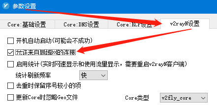
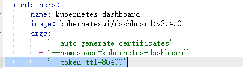
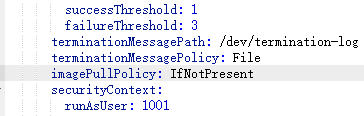
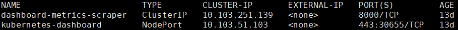
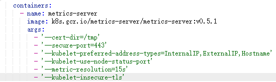
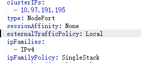
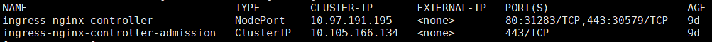

#### 服务器准备

系统配置

| 主机名 | IP 地址        | 系统版本 |
| ------ | -------------- | -------- |
| master | 192.168.40.191 | CentOS-7 |
| node01 | 192.168.40.192 | CentOS-7 |
| node02 | 192.168.40.195 | CentOS-7 |

修改`/etc/hosts`, 设置主机名解析

```
192.168.40.191  master
192.168.40.192  node01
192.168.40.195  node02
```

同步时间

```
ntpdate ntp1.aliyun.com
```

关闭 firewall 和 selinux

```
systemctl stop firewalld
systemctl disable firewalld
setenforce 0
```


#### 安装 docker

```
# 配置yum
yum install -y yum-utils
yum-config-manager --add-repo https://download.docker.com/linux/centos/docker-ce.repo
# 安装
yum update && yum install -y docker-ce docker-ce-cli containerd.io

## Create /etc/docker directory.
mkdir /etc/docker

# Setup daemon.
cat > /etc/docker/daemon.json <<EOF
{
  "exec-opts": ["native.cgroupdriver=systemd"],
  "log-driver": "json-file",
  "log-opts": {
    "max-size": "100m"
  },
  "storage-driver": "overlay2",
  "storage-opts": [
    "overlay2.override_kernel_check=true"
  ]
}
EOF

mkdir -p /etc/systemd/system/docker.service.d
systemctl start docker
systemctl enable docker
```


#### 部署 k8s

##### 准备翻墙环境

在本地 windows 电脑上开启 v2rayN 允许局域网的连接



设置 yum 代理

```
export http_proxy=socks5://192.168.40.200:10808
export https_proxy=socks5://192.168.40.200:10808
export no_proxy=localhost,127.0.0.1,192.168.40.200
```

修改文件`/usr/lib/systemd/system/docker.service`, 添加 Environment, 设置 docker pull 代理

```
[Service]
Environment="http_proxy=socks5://192.168.40.200:10808" "https_proxy=socks5://192.168.40.200:10808" "NO_PROXY=localhost,127.0.0.1,192.168.40.200"
```

重启 docker

```
systemctl daemon-reload
systemctl restart docker
```

快速切换脚本`change-docker-service.sh`

```
#!/bin/bash
grep Environment /usr/lib/systemd/system/docker.service
if grep "^#Environment" /usr/lib/systemd/system/docker.service ;then
    sed -i 's/\#Environment/Environment/g' /usr/lib/systemd/system/docker.service
elif grep "^Environment" /usr/lib/systemd/system/docker.service ;then
    sed -i 's/Environment/\#Environment/g' /usr/lib/systemd/system/docker.service
fi
grep Environment /usr/lib/systemd/system/docker.service
systemctl daemon-reload
systemctl restart docker
```

##### 安装 kubeadm、kubelet 和 kubectl

> worker 不需要安装 kubectl

```
# 配置yum，完成安装后删除
cat <<EOF > /etc/yum.repos.d/kubernetes.repo
[kubernetes]
name=Kubernetes
baseurl=https://packages.cloud.google.com/yum/repos/kubernetes-el7-x86_64
enabled=1
gpgcheck=1
repo_gpgcheck=1
gpgkey=https://packages.cloud.google.com/yum/doc/yum-key.gpg https://packages.cloud.google.com/yum/doc/rpm-package-key.gpg
EOF
# 安装
update-alternatives --set iptables /usr/sbin/iptables-legacy
yum install -y kubelet kubeadm kubectl --disableexcludes=kubernetes
systemctl enable kubelet
mv /etc/yum.repos.d/kubernetes.repo /tmp
```

##### 创建集群

修改 /etc/sysctl.d/99-sysctl.conf, 添加一下内容，并命令 sysctl -p 加载

```
net.bridge.bridge-nf-call-iptables = 1
```

关闭 swap，需要重启服务器

```
[root@centos7-002 ~]# cat /etc/fstab 
...
# /dev/mapper/centos-swap swap                    swap    defaults        0 0
```

初始化 master

> --kubernetes-version=v1.22.3 指定安装版本

```
kubeadm init --pod-network-cidr=10.244.0.0/16
```

要使非 root 用户可以运行 kubectl，请运行以下命令， 它们也是 `kubeadm init` 输出的一部分：

```bash
mkdir -p $HOME/.kube
sudo cp -i /etc/kubernetes/admin.conf $HOME/.kube/config
sudo chown $(id -u):$(id -g) $HOME/.kube/config
```

或者，如果你是 `root` 用户，则可以运行：

> 添加到 .bash_profile 文件中

```bash
export KUBECONFIG=/etc/kubernetes/admin.conf
```

配置网络

> 使用的镜像 quay.io/coreos/flannel:v0.12.0-amd64，为了加快速度可以提前准备

```
kubectl apply -f https://raw.githubusercontent.com/coreos/flannel/master/Documentation/kube-flannel.yml
```

测试运行是否正常

> coredns,flannel 都为 running，则正常

```
[root@centos7-001 ~]# kubectl get pods -n kube-system
NAME                                  READY   STATUS    RESTARTS   AGE
coredns-66bff467f8-9bjc6              1/1     Running   0          157m
coredns-66bff467f8-wbfpl              1/1     Running   0          157m
etcd-centos7-001                      1/1     Running   0          157m
kube-apiserver-centos7-001            1/1     Running   0          157m
kube-controller-manager-centos7-001   1/1     Running   0          157m
kube-flannel-ds-amd64-577mh           1/1     Running   0          151m
kube-flannel-ds-amd64-zdv87           1/1     Running   0          92m
kube-proxy-g2592                      1/1     Running   0          92m
kube-proxy-q8hzw                      1/1     Running   0          157m
kube-scheduler-centos7-001            1/1     Running   0          157m
```

节点加入

```
# 显示加入节点命令(在 master 执行)
kubeadm token create --print-join-command
# 加入节点(在 node 执行)
kubeadm join 192.168.40.201:6443 --token qqe25f.8l45ojbosy9hxpkc     --discovery-token-ca-cert-hash sha256:84a8f25f211461cfe9c33243445e1d31d0cb81944728c44804d806a022cc01fe
```

查看节点

```
[root@centos7-001 ~]# kubectl get nodes
NAME          STATUS   ROLES    AGE   VERSION
centos7-001   Ready    master   43h   v1.18.5
centos7-002   Ready    <none>   42h   v1.18.5
centos7-003   Ready    <none>   85m   v1.18.6
```

##### 部署 Dashboard UI

下载 yaml 文件

```
https://raw.githubusercontent.com/kubernetes/dashboard/v2.4.0/aio/deploy/recommended.yaml
```

添加参数`--token-ttl=86400` , 延长会话超时时间



修改 `imagePullPolicy: IfNotPresent`， 以免每次重新拉取镜像



修改 kubernetes-dashboard services，设置 type 和 nodePort

```
spec:
  type: NodePort
  ports:
    - port: 443
      targetPort: 8443
      nodePort: 30443
```

应用

```
kubectl apply -f recommended.yaml
```

查看服务 `kubectl get service -n kubernetes-dashboard`

> 访问地址为: https://masterip:30655



创建访问服务账号

```
apiVersion: v1
kind: ServiceAccount
metadata:
  name: admin-user
  namespace: kubernetes-dashboard
```

绑定角色

```
apiVersion: rbac.authorization.k8s.io/v1
kind: ClusterRoleBinding
metadata:
  name: admin-user
roleRef:
  apiGroup: rbac.authorization.k8s.io
  kind: ClusterRole
  name: cluster-admin
subjects:
- kind: ServiceAccount
  name: admin-user
  namespace: kubernetes-dashboard
```

查看 token

```
kubectl -n kubernetes-dashboard get secret $(kubectl -n kubernetes-dashboard get sa/admin-user -o jsonpath="{.secrets[0].name}") -o go-template="{{.data.token | base64decode}}"
```

##### 部署 Metrics Server

下载 yaml 文件

```
https://github.com/kubernetes-sigs/metrics-server/releases/latest/download/components.yaml
```

修改 deployment args 添加 `--kubelet-insecure-tls`



应用

```
kubectl apply -f components.yaml
```

等待1分钟左右，检测

```
[root@centos7-001 ~]# kubectl top nodes
NAME          CPU(cores)   CPU%   MEMORY(bytes)   MEMORY%   
centos7-001   150m         7%     1539Mi          41%       
centos7-002   28m          2%     504Mi           57%       
centos7-003   24m          2%     496Mi           56% 
```

##### 部署 NGINX Ingress Controller

在部署的节点上打上标签

```
kubectl label nodes <your-node-name> ingress=ingress-nginx
```

下载 yaml 文件

```
https://raw.githubusercontent.com/kubernetes/ingress-nginx/controller-v1.0.5/deploy/static/provider/baremetal/deploy.yaml
```

修改 ingress-nginx-controller deployment, 添加 selector

```
spec:
  nodeSelector:
    ingress: ingress-nginx
```

修改 ingress-nginx-controller service, 添加`externalTrafficPolicy: Local`, 方便后端获取真实 IP



查看服务 `kubectl get service -n ingress-nginx`



##### 部署 Nginx 反向代理 NGINX Ingress Controller

> 如果使用阿里云负载均衡访问服务，则不需要部署 nginx，可以将负载均衡的80端口号映射到 NGINX Ingress Controller 的 NodePort。
>
> 如果使用 NAT 或主机公网 IP 访问服务，则需要 Nginx 做反向代理。

配置 nginx yum 源

```
[nginx]
name=nginx repo
baseurl=http://nginx.org/packages/centos/7/$basearch/
gpgkey=http://nginx.org/keys/nginx_signing.key
gpgcheck=0
enabled=1
```

安装

```
yum install -y nginx
```

nignx 反向代理配置

```
upstream nginxingresscontroller {
    server nginx_ingress_controller_ip:nginx_ingress_controller_nodeport;
    ...
}

server {
	listen       80;
	listen       443;
    server_name  _;
	
    location / {
        proxy_pass http://nginxingresscontroller;
        proxy_redirect     off;
        proxy_set_header   Host             $http_host;
        proxy_set_header   X-Real-IP        $remote_addr;
        proxy_set_header   X-Forwarded-For  $proxy_add_x_forwarded_for;
        proxy_connect_timeout      120;
        proxy_send_timeout         120;
        proxy_read_timeout         120;
    }
}
```

##### 测试实例 hello

yaml 文件

```
apiVersion: v1
kind: Namespace
metadata:
  name: hello

---

apiVersion: apps/v1
kind: Deployment
metadata:
  name: backend
  namespace: hello
spec:
  selector:
    matchLabels:
      app: hello
  replicas: 3
  template:
    metadata:
      labels:
        app: hello
    spec:
      containers:
        - name: hello
          image: "gcr.io/google-samples/hello-go-gke:1.0"
          ports:
            - name: http
              containerPort: 80

---

apiVersion: v1
kind: Service
metadata:
  name: hello
  namespace: hello
spec:
  selector:
    app: hello
  ports:
  - protocol: TCP
    port: 80
    targetPort: http

---

apiVersion: networking.k8s.io/v1
kind: Ingress
metadata:
  name: hello-ingress
  namespace: hello
  annotations:
    nginx.ingress.kubernetes.io/rewrite-target: /$1
spec:
  ingressClassName: nginx
  rules:
    - host: www.hello.io
      http:
        paths:
          - path: /
            pathType: Prefix
            backend:
              service:
                name: hello
                port:
                  number: 80
```

应用

```
kubectl apply -f hello.yaml
```

本地 hosts 文件添加一条记录

```
192.168.40.191 www.hello.io
```

访问地址: http://www.hello.io/

