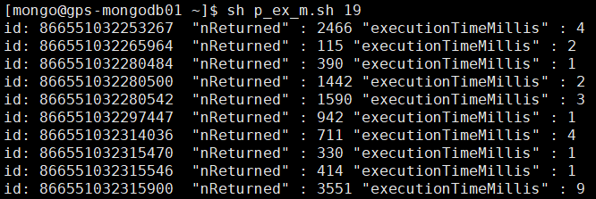
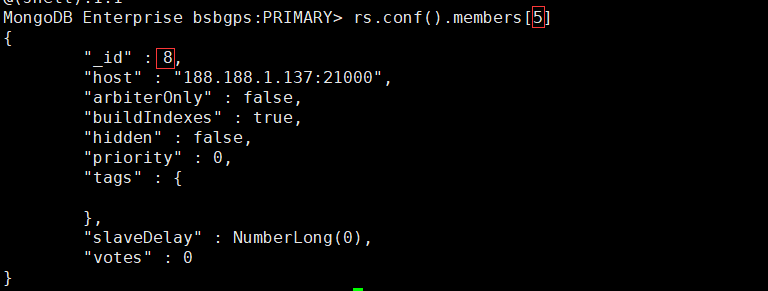

### 使用 tar 包安装 MongoDB 4.0

##### 禁用透明大页面(CentOS 7)

创建初始化脚本 /etc/init.d/disable-transparent-hugepages

```
#!/bin/bash
### BEGIN INIT INFO
# Provides:          disable-transparent-hugepages
# Required-Start:    $local_fs
# Required-Stop:
# X-Start-Before:    mongod mongodb-mms-automation-agent
# Default-Start:     2 3 4 5
# Default-Stop:      0 1 6
# Short-Description: Disable Linux transparent huge pages
# Description:       Disable Linux transparent huge pages, to improve
#                    database performance.
### END INIT INFO

case $1 in
  start)
    if [ -d /sys/kernel/mm/transparent_hugepage ]; then
      thp_path=/sys/kernel/mm/transparent_hugepage
    elif [ -d /sys/kernel/mm/redhat_transparent_hugepage ]; then
      thp_path=/sys/kernel/mm/redhat_transparent_hugepage
    else
      return 0
    fi

    echo 'never' > ${thp_path}/enabled
    echo 'never' > ${thp_path}/defrag

    re='^[0-1]+$'
    if [[ $(cat ${thp_path}/khugepaged/defrag) =~ $re ]]
    then
      # RHEL 7
      echo 0  > ${thp_path}/khugepaged/defrag
    else
      # RHEL 6
      echo 'no' > ${thp_path}/khugepaged/defrag
    fi

    unset re
    unset thp_path
    ;;
esac
```

启用

```
chmod 755 /etc/init.d/disable-transparent-hugepages
chkconfig --add disable-transparent-hugepages
systemctl start disable-transparent-hugepages
```

保留 tuned和ktune

```
# 创建目录
mkdir /etc/tuned/no-thp
# 创建文件 /etc/tuned/no-thp/tuned.conf
[main]
include=virtual-guest
[vm]
transparent_hugepages=never
# 执行已命令 
tuned-adm profile no-thp
```

验证结果

```
# 执行以下命令
cat /sys/kernel/mm/transparent_hugepage/enabled
cat /sys/kernel/mm/transparent_hugepage/defrag
# 正确的结果
always madvise [never]
```

##### 安装

安装依赖包

```
yum install -y libcurl openssl
```

下载安装包

```
wget https://fastdl.mongodb.org/linux/mongodb-linux-x86_64-rhel70-4.0.10.tgz
```

解压安装包

```
tar zxvf mongodb-linux-x86_64-rhel70-4.0.10.tgz 
mv mongodb-linux-x86_64-rhel70-4.0.10 mongodb
```

创建数据目录和日志目录

```
cd mongodb
mkdir data log
```

创建配置文件 mongod.conf

```
processManagement:
   fork: true
net:
   bindIp: 0.0.0.0
   port: 27017
storage:
   dbPath: /usr/local/mongodb/data/
   journal:
      enabled: true
   wiredTiger:
      engineConfig:
         cacheSizeGB: 0.5
systemLog:
   destination: file
   path: "/usr/local/mongodb/log/mongod.log"
   logAppend: true

operationProfiling:
   mode: slowOp
   slowOpThresholdMs: 1000
```

修改系统 limit 限制

```
# 在 /etc/security/limits.conf 添加以下行
*	 soft    nofile  65535
*	 hard    nofile  65535
*    soft    nproc   65535  
*    hard    nproc   65535 
# 修改 /etc/security/limits.d/20-nproc.conf 的以下行
*    soft    nproc     65535
*    hard    nproc     65535 
```

创建系统用户，用于管理 mongodb

```
groupadd -g 1200 mongo
useradd -u 1200 -g mongo mongo
passwd mongo
chown -R mongo.mongo /usr/local/mongodb/
```

启动 mongodb

```
su - mongo
cd /usr/local/mongodb
bin/mongod -f mongod.conf
```

登陆 mongodb

```
bin/mongo
```

关闭 mongodb

```
bin/mongod -f mongod.conf --shutdown
```

##### 启用身份认证

创建管理员账号

```
use admin
db.createUser(
  {
    user: "admin",
    pwd: "abc123",
    roles: [ { role: "userAdminAnyDatabase", db: "admin" }, "readWriteAnyDatabase" ]
  }
)
```

关闭 mongodb

```
bin/mongod -f mongod.conf --shutdown
```

修改配置文件，添加以下内容

```
security:
   authorization: enabled
```

启动 mongodb

```
bin/mongod -f mongod.conf
```

使用管理员账号登陆 mongodb

```
bin/mongo -u admin -p --authenticationDatabase admin
```

创建普通账号

```
use test
db.createUser(
  {
    user: "mongo",
    pwd: "xyz123",
    roles: [ { role: "readWrite", db: "test" },
             { role: "read", db: "reporting" } ]
  }
)
```

使用普通账号登陆

> 注意认证数据库

```
bin/mongo -u mongo -p --authenticationDatabase test
```

### 副本集

##### 部署副本集

配置文件

```
processManagement:
   fork: true
net:
   bindIp: 0.0.0.0
   port: 27017
storage:
   dbPath: /usr/local/mongodb/data/
   journal:
      enabled: true
   wiredTiger:
      engineConfig:
         cacheSizeGB: 0.5
systemLog:
   destination: file
   path: "/usr/local/mongodb/log/mongod.log"
   logAppend: true
operationProfiling:
   mode: slowOp
   slowOpThresholdMs: 1000
replication:
   replSetName: "rs"
```

初始化副本集

```
rs.initiate( {
   _id : "rs",
   members: [
      { _id: 0, host: "188.188.1.151:27017" },
      { _id: 1, host: "188.188.1.152:27017" },
      { _id: 2, host: "188.188.1.153:27017" }
   ]
})
```

##### 部署具有访问控制功能的副本集

生成密钥文件，并复制到每一个节点

```
openssl rand -base64 756 > rs.key
chmod 400 rs.key
```

配置文件

```
processManagement:
   fork: true
net:
   bindIp: 0.0.0.0
   port: 27017
storage:
   dbPath: /usr/local/mongodb/data/
   journal:
      enabled: true
   wiredTiger:
      engineConfig:
         cacheSizeGB: 0.5
systemLog:
   destination: file
   path: "/usr/local/mongodb/log/mongod.log"
   logAppend: true
operationProfiling:
   mode: slowOp
   slowOpThresholdMs: 1000
replication:
   replSetName: "rs"
security:
   keyFile: /usr/local/mongodb/rs.key
```

初始化副本集

```
rs.initiate( {
   _id : "rs",
   members: [
      { _id: 0, host: "188.188.1.151:27017" },
      { _id: 1, host: "188.188.1.152:27017" },
      { _id: 2, host: "188.188.1.153:27017" }
   ]
})
```

创建管理员用户

```
admin = db.getSiblingDB("admin")
admin.createUser(
  {
    user: "admin",
    pwd: "mongo",
    roles: [ { role: "userAdminAnyDatabase", db: "admin" } ]
  }
)
```

使用管理员账号登陆

```
bin/mongo -u "admin" -p "mongo" --authenticationDatabase "admin"
```

创建管理副本集群的账号，用于配置副本集

```
db.getSiblingDB("admin").createUser(
  {
    "user" : "rsadmin",
    "pwd" : "mongo",
    roles: [ { "role" : "clusterAdmin", "db" : "admin" } ]
  }
)
```

创建数据库管理账号

```
use tdb
db.createUser(
  {
    user: "tuser",
    pwd: "mongo",
    roles: [ { role: "readWrite", db: "tdb" } ]
  }
)
```

使用数据库管理员账号登陆

```
bin/mongo -u "admin" -p "mongo" --authenticationDatabase "tdb"
```

删除数据库管理账号

```
use tdb
db.dropUser("tuser")
```

##### 在线对副本集添加访问控制功能

登陆 PRIMARY 节点，创建管理员账号

```
admin = db.getSiblingDB("admin")
admin.createUser(
  {
    user: "admin",
    pwd: "mongo",
    roles: [ { role: "userAdminAnyDatabase", db: "admin" } ]
  }
)
```

创建集群管理员账号

```
db.getSiblingDB("admin").createUser(
  {
    "user" : "cadmin",
    "pwd" : "mongo",
    roles: [ { "role" : "clusterAdmin", "db" : "admin" } ]
  }
)
```

创建数据库管理账号

```
db.getSiblingDB("tdb").createUser(
  {
    "user" : "tuser",
    "pwd" : "mongo",
    roles: [ { "role" : "readWrite", "db" : "tdb" } ]
  }
)
```

更新客户端，新增认证信息，此时客户端有认证信息和没有认证信息都可以访问

```
bin/mongo  -u tuser -password mongo -authenticationDatabase tdb --host "rs/188.188.1.151:27017, 188.188.1.152:27017, 188.188.1.153:27017"
```

生成密钥文件，并复制到每一个节点

```
openssl rand -base64 756 > rs.key
chmod 400 rs.key
```

在副本集所有节点配置文件添加启用认证配置

```
security:
   keyFile: /usr/local/mongodb/rs.key
   transitionToAuth: true
# transitionToAuth 设置认证和非认证都可以连接
```

依次重启 SECONDARY 节点

```
bin/mongod -f rs.conf --shutdown
bin/mongod -f rs.conf
```

将 PRIMARY 转换为 SECONDARY 节点，并重启

```
rs.stepDown()
bin/mongod -f rs.conf --shutdown
bin/mongod -f rs.conf
```

在副本集所有节点配置文件去除 transitionToAuth

```
security:
   keyFile: /usr/local/mongodb/rs.key
```

依次重启 SECONDARY 节点

```
bin/mongod -f rs.conf --shutdown
bin/mongod -f rs.conf
```

将 PRIMARY 转换为 SECONDARY 节点，并重启

```
rs.stepDown()
bin/mongod -f rs.conf --shutdown
bin/mongod -f rs.conf
```

##### 强制切换 PRIMARY 节点

当前副本集状态

```
mdb0.example.net - the current primary.
mdb1.example.net - a secondary.
mdb2.example.net - a secondary .
```

冻结节点 mdb2.example.net 120秒

```
rs.freeze(120)
```

降级节点 mdb0.example.net 120秒

```
rs.stepDown(120)
```

##### 新增节点

清空新节点的数据目录

```
rm -rf data/*
```

启动新节点

```
bin/mongod -f rs.conf
```

在 PRIMARY 节点添加新节点，新节点自动同步数据

```
rs.add( { host: "188.188.1.153:27017", priority: 0, votes: 0 } )
```

确认新增节点的 ID

```
rs.conf()
```

新节点转换为 SECONDARY状态后，更新新添加节点的 priority和 votes

```
var cfg = rs.conf();
cfg.members[2].priority = 1
cfg.members[2].votes = 1
rs.reconfig(cfg)
```

### 分片

##### 部署分片集群

配置副本集配置文件 configrs.conf

```
processManagement:
   fork: true
net:
   bindIp: 0.0.0.0
   port: 27000
storage:
   dbPath: /usr/local/mongodb/config/data/
   journal:
      enabled: true
   wiredTiger:
      engineConfig:
         cacheSizeGB: 0.5
systemLog:
   destination: file
   path: "/usr/local/mongodb/config/log/mongod.log"
   logAppend: true
operationProfiling:
   mode: slowOp
   slowOpThresholdMs: 1000
sharding:
   clusterRole: configsvr
replication:
   replSetName: configrs
```

初始化配置副本集

```
rs.initiate(
  {
    _id: "configrs",
    configsvr: true,
    members: [
      { _id : 0, host : "cfg1.example.net:27000" },
      { _id : 1, host : "cfg2.example.net:27000" },
      { _id : 2, host : "cfg3.example.net:27000" }
    ]
  }
)
```

分片副本集 shardrs01 配置文件 shardrs01.conf

```
processManagement:
   fork: true
net:
   bindIp: 0.0.0.0
   port: 27001
storage:
   dbPath: /usr/local/mongodb/shardrs01/data/
   journal:
      enabled: true
   wiredTiger:
      engineConfig:
         cacheSizeGB: 0.5
systemLog:
   destination: file
   path: "/usr/local/mongodb/shardrs01/log/mongod.log"
   logAppend: true
operationProfiling:
   mode: slowOp
   slowOpThresholdMs: 1000
sharding:
   clusterRole: shardsvr
replication:
   replSetName: shardrs01
```

初始化分片副本集 shardrs01

```
rs.initiate(
  {
    _id : "shardrs01",
    members: [
      { _id : 0, host : "s1-mongo1.example.net:27001" },
      { _id : 1, host : "s1-mongo2.example.net:27001" },
      { _id : 2, host : "s1-mongo3.example.net:27001" }
    ]
  }
)
```

分片副本集 shardrs02配置文件 shardrs02.conf

```
processManagement:
   fork: true
net:
   bindIp: 0.0.0.0
   port: 27002
storage:
   dbPath: /usr/local/mongodb/shardrs02/data/
   journal:
      enabled: true
   wiredTiger:
      engineConfig:
         cacheSizeGB: 0.5
systemLog:
   destination: file
   path: "/usr/local/mongodb/shardrs02/log/mongod.log"
   logAppend: true 
operationProfiling:
   mode: slowOp
   slowOpThresholdMs: 1000
sharding:
   clusterRole: shardsvr
replication:
   replSetName: shardrs02
```

初始化分片副本集 shardrs02

```
rs.initiate(
  {
    _id : "shardrs02",
    members: [
      { _id : 0, host : "s1-mongo1.example.net:27002" },
      { _id : 1, host : "s1-mongo2.example.net:27002" },
      { _id : 2, host : "s1-mongo3.example.net:27002" }
    ]
  }
)
```

路由配置文件 mongos.conf

```
processManagement:
   fork: true
net:
   bindIp: 0.0.0.0
   port: 27017
systemLog:
   destination: file
   path: "/usr/local/mongodb/mongos/log/mongod.log"
   logAppend: true
sharding:
   configDB: configrs/188.188.1.151:27000,188.188.1.152:27000,188.188.1.153:27000
```

启动 mongos

```
bin/mongos -f mongos.conf
```

添加分片副本集

```
sh.addShard("shardrs01/188.188.1.151:27001")
sh.addShard("shardrs02/188.188.1.151:27002")
```

数据库启用分片

```
sh.enableSharding("<database>")
```

指定集合分片键

```
sh.shardCollection("<database>.<collection>", { <shard key> : "hashed" } )
# 如果集合没有数据，可以使用任何字段作为分片键
# 如果集合已经存在数据，需要先创建索引，或使用 _id 字段作为分片键
```

##### 部署具有访问控制功能的分片集群

生成密钥文件，并复制到每一个 mongod、mongos 节点

```
openssl rand -base64 756 > rs.key
chmod 400 rs.key
```

配置副本集配置文件 configrs.conf

```
processManagement:
   fork: true
net:
   bindIp: 0.0.0.0
   port: 27000
storage:
   dbPath: /usr/local/mongodb/config/data/
   journal:
      enabled: true
   wiredTiger:
      engineConfig:
         cacheSizeGB: 0.5
systemLog:
   destination: file
   path: "/usr/local/mongodb/config/log/mongod.log"
   logAppend: true
operationProfiling:
   mode: slowOp
   slowOpThresholdMs: 1000
sharding:
   clusterRole: configsvr
replication:
   replSetName: configrs
security:
   keyFile: /usr/local/mongodb/rs.key
```

登陆配置副本集主节点，初始化副本集

```
rs.initiate(
  {
    _id: "configrs",
    configsvr: true,
    members: [
      { _id : 0, host : "188.188.1.151:27000" },
      { _id : 1, host : "188.188.1.152:27000" },
      { _id : 2, host : "188.188.1.153:27000" }
    ]
  }
)
```

分片副本集配置文件 shardrs01.conf

```
processManagement:
   fork: true
net:
   bindIp: 0.0.0.0
   port: 27001
storage:
   dbPath: /usr/local/mongodb/shardrs01/data/
   journal:
      enabled: true
   wiredTiger:
      engineConfig:
         cacheSizeGB: 0.5
systemLog:
   destination: file
   path: "/usr/local/mongodb/shardrs01/log/mongod.log"
   logAppend: true
operationProfiling:
   mode: slowOp
   slowOpThresholdMs: 1000
sharding:
   clusterRole: shardsvr
replication:
   replSetName: shardrs01
security:
   keyFile: /usr/local/mongodb/rs.key
```

初始化分片副本集

```
rs.initiate(
  {
    _id : "shardrs01",
    members: [
      { _id : 0, host : "188.188.1.151:27001" },
      { _id : 1, host : "188.188.1.152:27001" },
      { _id : 2, host : "188.188.1.153:27001" }
    ]
  }
)
```

创建分片副本集本地管理员账号

```
admin = db.getSiblingDB("admin")
admin.createUser(
  {
    user: "admin",
    pwd: "mongo",
    roles: [ { role: "userAdminAnyDatabase", db: "admin" } ]
  }
)
```

进行本地管理员认证

```
db.getSiblingDB("admin").auth("admin", "mongo")
```

创建分片副本集本地集群管理账号

```
db.getSiblingDB("admin").createUser(
  {
    "user" : "radmin",
    "pwd" : "mongo",
    roles: [ { "role" : "clusterAdmin", "db" : "admin" } ]
  }
)
```

mongos  配置文件 mongos.conf

```
processManagement:
   fork: true
net:
   bindIp: 0.0.0.0
   port: 27017
systemLog:
   destination: file
   path: "/usr/local/mongodb/mongos/log/mongod.log"
   logAppend: true
sharding:
   configDB: configrs/188.188.1.151:27000,188.188.1.152:27000,188.188.1.153:27000
security:
   keyFile: /usr/local/mongodb/rs.key
```

登陆 mongos 创建管理账号

```
admin = db.getSiblingDB("admin")
admin.createUser(
  {
    user: "sadmin",
    pwd: "mongo",
    roles: [ { role: "userAdminAnyDatabase", db: "admin" } ]
  }
)
```

进行 mongos 管理员认证

```
db.getSiblingDB("admin").auth("sadmin", "mongo")
```

创建分片集群管理账号

```
db.getSiblingDB("admin").createUser(
  {
    "user" : "radmin",
    "pwd" : "mongo",
    roles: [ { "role" : "clusterAdmin", "db" : "admin" } ]
  }
)
```

创建数据库管理账号

```
db.getSiblingDB("tdb").createUser(
  {
    "user" : "tuser",
    "pwd" : "mongo",
    roles: [ { "role" : "readWrite", "db" : "tdb" } ]
  }
)
```

使用分片集群管理账号进行认证

```
db.getSiblingDB("admin").auth("cadmin","mongo")
```

添加分片

```
sh.addShard("shardrs01/188.188.1.151:27001")
```

启用数据库分片

```
sh.enableSharding("tdb")
```

创建集合分片键

```
sh.shardCollection("tdb.tcoll", { _id : 1 })
```

##### 向分片集群中添加分片

搭建分片副本集

将分片副本集添加到分片集群中

```
sh.addShard("shardrs03/188.188.1.151:27003")
```

一段时间后，数据自动进行迁移，使得数据均匀的发布到每个分片中

##### 删除分片

查看要删除的分片是否是某数据库的主分片

```
sh.status()
```

如果要删除的分片是某集合的主分片，则需要进行迁移

```
db.adminCommand( { movePrimary: "ycsb", to: "shardrs02" })
```

如果要删除的分片部署任何集合的主分片，则直接删除

```
db.adminCommand( { removeShard: "shardrs01" } )
# 可以多次执行，查看迁移状态
# 如果数据量很大，迁移会花费很长的时间
```

##### 将副本集转换为分片集群

3节点副本集配置文件 shardrs01.conf

```
processManagement:
   fork: true
net:
   bindIp: 0.0.0.0
   port: 27001
storage:
   dbPath: /usr/local/mongodb/shardrs01/data/
   journal:
      enabled: true
   wiredTiger:
      engineConfig:
         cacheSizeGB: 0.5
systemLog:
   destination: file
   path: "/usr/local/mongodb/shardrs01/log/mongod.log"
   logAppend: true
operationProfiling:
   mode: slowOp
   slowOpThresholdMs: 1000
replication:
   replSetName: shardrs01
```

副本集配置文件添加以下内容

```
sharding:
   clusterRole: shardsvr
```

依次重启 SECONDARY 节点

```
bin/mongod -f shardrs01.conf --shutdown
bin/mongod -f shardrs01.conf
```

将 PRIMARY 节点转为 SECONDARY 节点并重启

```
rs.stepDown()
bin/mongod -f shardrs01.conf --shutdown
bin/mongod -f shardrs01.conf
```

配置副本集配置文件 configrs.conf

```
processManagement:
   fork: true
net:
   bindIp: 0.0.0.0
   port: 27000
storage:
   dbPath: /usr/local/mongodb/config/data/
systemLog:
   destination: file
   path: "/usr/local/mongodb/config/log/mongod.log"
   logAppend: true
storage:
   journal:
      enabled: true
operationProfiling:
   mode: slowOp
   slowOpThresholdMs: 1000
sharding:
   clusterRole: configsvr
replication:
   replSetName: configrs
```

路由配置文件

```
processManagement:
   fork: true
net:
   bindIp: 0.0.0.0
   port: 27017
systemLog:
   destination: file
   path: "/usr/local/mongodb/mongos/log/mongod.log"
   logAppend: true
sharding:
   configDB: configrs/188.188.1.151:27000,188.188.1.152:27000,188.188.1.153:27000
```

登陆 mongs 添加分片

```
sh.addShard("shardrs01/188.188.1.151:27001")
```

添加第二个分片

```
sh.addShard("shardrs02/188.188.1.152:27002")
```

设置数据库启用分片

```
sh.enableSharding( "tdb" )
```

设置集合的分片键

```
sh.shardCollection( "tdb.tcoll", { "_id" : 1 } )
# 如果集群中不存在数据，可以指定任一字段作为分片键
# 如果集合已经存在数据，可以使用 "_id" 作为分片键，或创建新的索引
```

### 常用命令

##### mongo shell

登陆 mongodb

```
mongo --host mongodb0.example.com --port 27017
```

登陆使用了认证的 mongodb

```
mongo --username alice --password --authenticationDatabase admin --host mongodb0.examples.com --port 28015
```

登陆副本集

```
mongo --host replA/188.188.1.151:27017,188.188.1.152:27017,188.188.1.153:27017
```

格式化打印

```
db.myCollection.find().pretty()
```

##### 数据库

显示数据库

```
show dbs
```

设置显示记录的数量

```
DBQuery.shellBatchSize = 1000
```

##### 集合

显示集合

```
use test
show collections
```

返回集合的大小

```
db.collection.dataSize()
```

##### 索引

创建升序索引

```
db.records.createIndex( { score: 1 } )
```

创建降序索引

```
db.collection.createIndex( { name: -1 } )
```

创建复合索引

```
db.products.createIndex( { "item": 1, "stock": 1 } )
```

创建文本索引

```
db.reviews.createIndex( { comments: "text" } )
```

创建哈希索引

```
db.collection.createIndex( { _id: "hashed" } )
```

查看集合的索引

```
db.people.getIndexes()
```

通过集合字段生成索引

```
db.accounts.dropIndex( { "tax-id": 1 } )
```

删除索引

```
db.pets.dropIndex( "catIdx" )
```

删除集合的所有索引

```
db.accounts.dropIndexes()
```

查看查询是否使用了索引

```
db.products.find(
   { quantity: { $gt: 50 }, category: "apparel" }
).explain("executionStats")
```

##### 副本集

配置 SECONDARY 可读

```
rs.slaveOk()
```

查看 SECONDARY 同步状况

```
rs.printSlaveReplicationInfo()
```

查看副本集配置

```
rs.conf()
```

查看集群状态

```
rs.status()
```

查看 PRIMARY 节点

```
rs.isMaster()
```

删除节点

```
rs.remove("mongod3.example.net:27017")
```

##### 分片

查看分片状态

```
sh.status()
```

查看分片集群中的数据副本集

```
db.adminCommand( { listShards: 1 } )
```

##### 慢日志

查看慢日志状况

```
db.getProfilingStatus()
```

启用慢日志

```
db.setProfilingLevel(1, { slowms: 2000 })
# slowms 单位为毫秒
```

禁用慢日志

```
db.setProfilingLevel(0)
```

### JS 脚本

##### 生成测试数据

脚本文件 save.js 内容

```
function dateFtt(fmt,date)   
{ //author: meizz   
  var o = {   
    "M+" : date.getMonth()+1,                 //月份   
    "d+" : date.getDate(),                    //日   
    "h+" : date.getHours(),                   //小时   
    "m+" : date.getMinutes(),                 //分   
    "s+" : date.getSeconds(),                 //秒   
    "q+" : Math.floor((date.getMonth()+3)/3), //季度   
    "S"  : date.getMilliseconds()             //毫秒   
  };   
  if(/(y+)/.test(fmt))   
    fmt=fmt.replace(RegExp.$1, (date.getFullYear()+"").substr(4 - RegExp.$1.length));   
  for(var k in o)   
    if(new RegExp("("+ k +")").test(fmt))   
  fmt = fmt.replace(RegExp.$1, (RegExp.$1.length==1) ? (o[k]) : (("00"+ o[k]).substr((""+ o[k]).length)));   
  return fmt;   
} 

db = db.getSiblingDB("tdb")
db.dropDatabase()
db.tcoll.createIndex( { dt: 1 } )

for (i=0;i<1000;i++) {
  var types = ["red","green","white","black"]
  var names = ["aaa","bbb","ccc","ddd","eee","fff"]
  var dt = dateFtt("yyyy-MM-dd hh:mm:ss",new Date())
  var count = Math.ceil(Math.random()*100)+1
  var type = types[Math.ceil(Math.random()*4)-1]
  var name = names[Math.ceil(Math.random()*5)-1]
  var desc = "VGhlIGxvYWQoKSBtZXRob2QgYWNjZXB0cyByZWxhdGl2ZSBhbmQgYWJzb2x1dGUgcGF0aHMuIElmIHRoZSBjdXJyZW50IHdvcmtpbmcgZGlyZWN0b3J5IG9mIHRoZSBtb25nbyBzaGVsbCBpcyAvZGF0YS9kYiwgYW5kIHRoZSBteWpzdGVzdC5qcyByZXNpZGVzIGluIHRoZSAvZGF0YS9kYi9zY3JpcHRzIGRpcmVjdG9yeSwgdGhlbiB0aGUgZm9sbG93aW5nIGNhbGxzIHdpdGhpbiB0aGUgbW9uZ28gc2hlbGwgd291bGQgYmUgZXF1aXZhbGVudDo="
  
  db.tcoll.save({_id:i,name:name,type:type,count:count,createdAt:dt,description:desc})
}
```

执行脚本

```
bin/mongo save.js 
```

##### 使用 explain 函数测试性能

脚本 p_ex_m.sh 内容

```
#!/bin/bash
g='$gte'
l='$lte'
d=$1
b=`date -d "2019-08-$d 00:00:00" +%s`
e=`date -d "2019-08-$d 23:59:59" +%s`

cat id_m.txt | while read line
do
    a=`mongo --host 192.168.1.38 --port 27001 <<EOF
    rs.slaveOk()
    use basiba-history-2019-08
    db.history$d.find({ "devId" : "$line", "sysTime" : { "$g" : $b,  "$l": $e } }).hint({"devId": 1, "sysTime": 1}).explain("executionStats").executionStats;
EOF`
    echo "id: $line "`echo $a | awk -NF '{' '{print $2}' | awk -NF ',' '{print $2,$3}'` | grep -v ": 0"
done
```

文件 id_m.txt 内容

```
868035042425956
868035042425980
868035042426004
868035042426061
868035042426129
868035042426178
868035042426400
868035042426483
868035042426806
868035042428265
```

输出内容




### 常见问题

##### rs.conf() 输出的 members[n] 的 _id  无关

如下图所示

