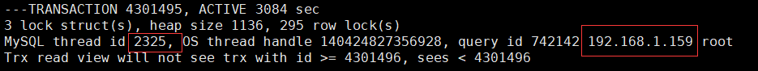

#### group_replication 无法打开

问题：修改 innodb_log_file_size 大小后，启动 group_replication 报以下错误

```
2019-05-17T14:19:37.750856+08:00 45368 [ERROR] Slave SQL for channel 'group_replication_recovery': Worker 1 failed executing transaction 'bbb7a0a4-698d-11e9-8672-000c29be2a23:50573218' at master log binlog.000079, end_log_pos 728688573; Could not execute Write_rows event on table sbtest.sbtest2; Duplicate entry '3261324' for key 'PRIMARY', Error_code: 1062; handler error HA_ERR_FOUND_DUPP_KEY; the event's master log FIRST, end_log_pos 728688573, Error_code: 1062
```

处理方法：重新创建该节点

#### 从节点 SQL 线程挂起

问题：延迟从节点 SQL 线程挂起，执行 "stop slave" 后报以下错误

```
2019-05-30T16:11:16.167351+08:00 2 [Warning] Slave SQL for channel '': Coordinator thread of multi-threaded slave is being stopped in the middle of assigning a group of events; deferring to exit until the group completion ... , Error_code: 0
2019-05-30T16:12:18.170057+08:00 2 [ERROR] Slave SQL for channel '': ... The slave coordinator and worker threads are stopped, possibly leaving data in inconsistent state. A restart should restore consistency automatically, although using non-transactional storage for data or info tables or DDL queries could lead to problems. In such cases you have to examine your data (see documentation for details). Error_code: 1756
```

处理方法：去除配置文件中的 slave-preserve-commit-order=1

#### 解决 MySQL 线程阻塞的问题

执行命令查看阻塞的线程

```
mysql> show engine innodb status\G
```



```
mysql> kill 2325
```