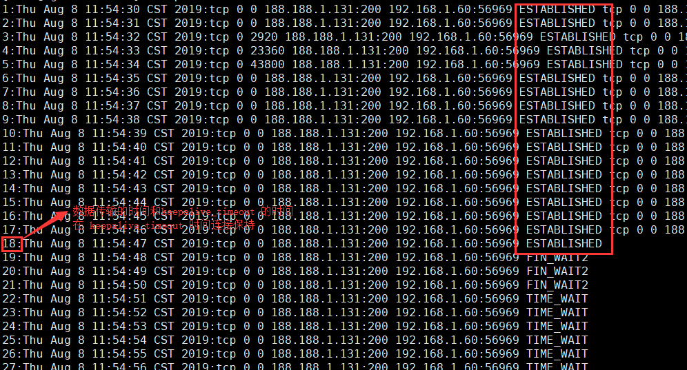

### 安装 openresty

安装依赖包

```
yum install -y pcre-devel openssl-devel gcc curl postgresql-devel
```

下载安装包

```
wget https://openresty.org/download/openresty-1.13.6.2.tar.gz
```

安装

```
tar -xzvf openresty-1.13.6.2.tar.gz
cd openresty-1.13.6.2
./configure --prefix=/usr/local/openresty \
    --with-luajit \
    --without-http_redis2_module \
    --with-http_iconv_module \
    --with-http_postgres_module
make && make install
```

### 常见问题

##### http 重定向到 https 引起的问题

起因：在 nginx 配置文件中添加以下配置，实现对 http 的访问跳转到 https

```
return 301 https://$host$request_uri;
```

引起的问题：

- 苹果 app 发出的 post 请求变成 get 请求

- 在 nginx 中将重定向取消后，浏览器 app 还是重定向到 https

原因分析：重定向缓存到了浏览器和 app 中

- 301: 永久性转移(Permanently Moved)
- 302: 暂时性转移(Temporarily Moved)

恢复处理方法：

- 清理浏览器缓存
- 重新安装 app

重新配置 nginx

```
return 307 https://$host$request_uri;
```

##### nginx http 请求流程与连接限制

任何 http 一个请求都需要一个连接来处理，访问一个 html 页面可能会有多个请求，但不一定会建立多个连接。如果客户端和 nginx 不存在连接，在服务器会开启一个新的端口号创建一个新的连接，如果存在了连接，并连接状态为 ESTABLISHED，则同一客户端新的请求仍然可以使用这个连接。keepalive_requests指令用于设置一个keep-alive连接上可以服务的请求的最大数量。当最大请求数量达到时，连接被关闭。默认是100。keepalive_timeout 设置连接超时的值，默认值为75s，指的是连接没有传输数据的时间。如果超过了这个时间需要建立一个新的连接。

keepalive_timeout  的值如下

```
keepalive_timeout 10s;
```

浏览打开页面查看端口状态



最大连接配置（有数据传输的连接才会被计算在内，keepalive_timeout 时间内的连接不被计算）

```
limit_conn_zone $server_name zone=perserver:10m;
server {
        listen       200;
        server_name  localhost;
        location / {
                limit_conn perserver 1;
                root /tmp;
        }
}
```

