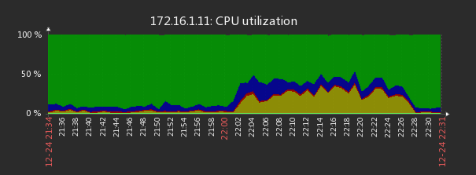
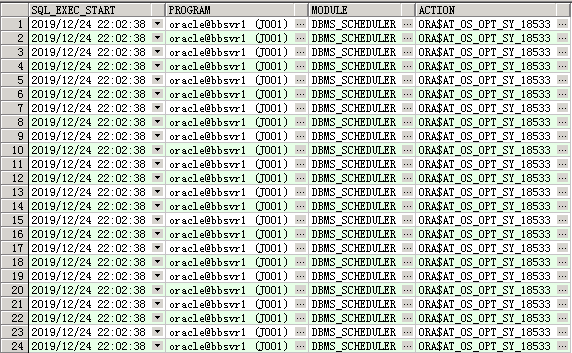
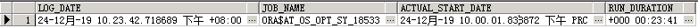

## 实时分析不可重现的问题

> 所用脚本下载地址： https://github.com/Apress/troubleshooting-oracle-perf-14/tree/master/chapter04

**显示最后一小时的系统活动率**

> 两个参数分别代表的是会话的 sid 和 sql id。第一个参数如果设置为 all 表示所有的会话，第二个参数如果设置为 all 表示所有的 sql。

```
@ash_acitvity.sql all all
```

**显示 top sql 活动率**

> 第一个参数：开始时间
>
> 第二个参数：结束时间
>
> 第三个参数：会话 sid ，all 表示所有会话

```
@ash_top_sqls.sql 2019-12-23_09:00:00.000 2019-12-23_09:30:00.000 all
```

**显示 top session 活动率**

> 第一个参数：开始时间
>
> 第二个参数：结束时间

```
@ash_top_sessions.sql 2019-12-23_09:00:00.000 2019-12-23_09:30:00.000
```

**显示 top actions 活动率**

> 第一个参数：开始时间
>
> 第二个参数：结束时间

```
@ash_top_actions.sql 2019-12-23_09:30:00.000 2019-12-23_10:30:00.000
```

**显示 top clients 活动率**

> 第一个参数：开始时间
>
> 第二个参数：结束时间

```
@ash_top_clients.sql 2019-12-23_09:30:00.000 2019-12-23_10:30:00.000
```

**查询 SQL 语句的基本信息**

```
select SQL_FULLTEXT,PARSING_SCHEMA_NAME,MODULE,LAST_ACTIVE_TIME 
       FROM v$sql 
       where sql_id='1y18460p76jrv';
```

**查询 SQL 语句的执行信息**

```
select sql_id,count(*),sql_opname,min(sample_time),max(sample_time),
program,module,action,machine
       from v$active_session_history
       where sql_id='1y18460p76jrv'
       group by sql_id,sql_opname,program,module,action,machine;

```


## 性能分析实例

#### 实例1：由于系统自动定时任务引起的 IO 使用率高的问题

监控系统显示 IO 使用率急速升高



查看这一时段的 top sql ，sql id "81gkqdt4tc4mu" 存在可疑

```
SQL> @ash_top_sqls.sql 2019-12-24_22:00:00.000 2019-12-24_22:10:00.000 all
Activity%    DB Time   CPU% UsrIO%  Wait% SQL Id        SQL Type
--------- ---------- ------ ------ ------ ------------- ----------------------------
     21.8        662   26.7   21.0   52.3 acd5hdxk3x4n2 SELECT
     14.5        441    5.2   84.1   10.7 81gkqdt4tc4mu SELECT
      8.1        246    0.4   99.6    0.0 8szmwam7fysa3 INSERT
      6.4        195   25.6   72.3    2.1 cb5vgtz0hwc57 SELECT
      5.3        161   13.7   83.2    3.1 c6ksc6kfhjjc6 SELECT
      3.9        117   21.4   24.8   53.8 aaujw46190d8s SELECT
      2.7         82   30.5   14.6   54.9 9z42fbxy30xa6 SELECT
      2.0         60   10.0   90.0    0.0 7tqzpr5y4razj SELECT
      1.9         59    1.7   94.9    3.4 424h0nf7bhqzd SELECT
      1.6         49   20.4   79.6    0.0 4770ag9hpgu38 SELECT
```

查询 "81gkqdt4tc4mu" 执行记录，发现与 IO 使用率升高的时间点相吻合，并且是一个系统自动定时任务

```
select SQL_EXEC_START,PROGRAM,MODULE,ACTION from v$active_session_history where sql_id='81gkqdt4tc4mu';
```



查询该 job 并不存在

```
SELECT * FROM DBA_SCHEDULER_JOBS WHERE JOB_NAME = 'ORA$AT_OS_OPT_SY_18533';
```

查询该 job 的执行记录，发现时间吻合

```
select LOG_DATE,JOB_NAME,ACTUAL_START_DATE,RUN_DURATION 
    from user_scheduler_job_run_details 
    where job_name='ORA$AT_OS_OPT_SY_18533';
```



## 常用脚本

##### 每10分钟获取 oracle top sql 定时任务脚本 get_oracle_top_sql.sh

```
#!/bin/bash
set -e
echo ""
echo "#################################################################"
date
cd /home/oracle/perfsql
str_time=`date --date='10 minute ago' +%F_%R`:00.000
end_time=`date +%F_%R`:00.000
echo "Start Time: $str_time  End Time: $end_time"
source ~/.bash_profile
sqlplus -S "/ as sysdba" <<  EOF
@ash_top_sqls.sql $str_time $end_time all
quit
EOF
```

