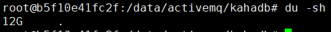
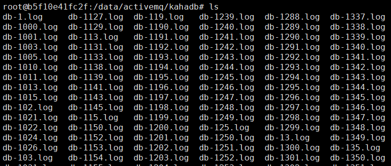

##### 使用 docker 部署 activemq

```
docker run --name='activemq' -d \
-e 'ACTIVEMQ_CONFIG_NAME=amqp-srv1' \
-e 'ACTIVEMQ_CONFIG_DEFAULTACCOUNT=false' \
-e 'ACTIVEMQ_ADMIN_LOGIN=admin' -e 'ACTIVEMQ_ADMIN_PASSWORD=password' \
-e 'ACTIVEMQ_USERS_myproducer=producerpassword' -e 'ACTIVEMQ_GROUPS_writes=myproducer' \
-e 'ACTIVEMQ_USERS_myconsumer=consumerpassword' -e 'ACTIVEMQ_GROUPS_reads=myconsumer' \
-e 'ACTIVEMQ_JMX_user1_role=readwrite' -e 'ACTIVEMQ_JMX_user1_password=jmx_password' \
-e 'ACTIVEMQ_JMX_user2_role=read' -e 'ACTIVEMQ_JMX_user2_password=jmx2_password' \
-e 'ACTIVEMQ_CONFIG_TOPICS_topic1=mytopic1' -e 'ACTIVEMQ_CONFIG_TOPICS_topic2=mytopic2'  \
-e 'ACTIVEMQ_CONFIG_QUEUES_queue1=myqueue1' -e 'ACTIVEMQ_CONFIG_QUEUES_queue2=myqueue2'  \
-e 'ACTIVEMQ_CONFIG_MINMEMORY=1024' -e  'ACTIVEMQ_CONFIG_MAXMEMORY=4096' \
-e 'ACTIVEMQ_CONFIG_SCHEDULERENABLED=true' \
-v /data/activemq:/data \
-v /var/log/activemq:/var/log/activemq \
-p 8161:8161 \
-p 61616:61616 \
-p 61613:61613 \
webcenter/activemq:5.14.3
```


##### 问题：/data/activemq/kahadb 目录过大，并且持续增长



产生原因：消息生产者启用了消息持久化，产生了大量的 log 文件



处理方法：

禁用持久化，在 broker 处添加 persistent="false"

```
<broker persistent="false" ...>
  ...
</broker>
```

删除 log 文件，在 kahaDB 添加 ignoreMissingJournalfiles="true"，避免启动时检查 log 文件

> 如果禁用了持久化，ignoreMissingJournalfiles 不设置也不会检查 log 文件。
>
> 如果有 log 文件被删除，需要启用持久化，则必须设置 ignoreMissingJournalfiles="true"，否则无法启动。

```
<persistenceAdapter>
  <kahaDB ignoreMissingJournalfiles="true" .../>
</persistenceAdapter>
```

