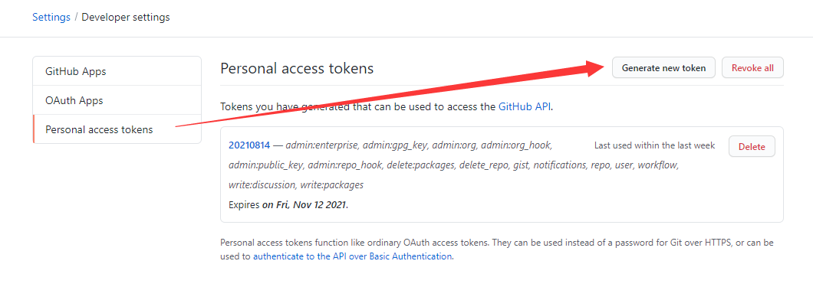

#### 常用命令

查看当前仓库配置信息

```
git config --local  --list
```

查看当前用户（global）配置

```
git config --global  --list
```

查看系统config

```
git config --system --list
```

设置全局账号

```
git config --global credential.helper store
git config --global user.email "你的git的注册邮箱"
git config --global user.user "你的git用户名"
```

设置当前仓库账号

```
git config --local credential.helper store
git config --local user.email "你的git的注册邮箱"
git config --local user.user "你的git用户名"
```

修改 remote.origin.url

```
git remote set-url origin https://<username>:<token>@github.com/huhaiqng/devops-note.git
```

#### 创建 token

Settings > Developer settings > Personal access tokens > Generate new token

> 注意选取适当的权限



#### 将 github 的项目拉到本地并修改提交

在本地新建项目文件夹

初始化项目

```
git init
git remote add origin https://<username>:<token>@github.com/huhaiqng/devops-note.git
```

拉取代码

```
git pull https://<username>:<token>@github.com/huhaiqng/devops-note.git master
```

改动后提交

```
git add .
git commit -m "commit"
git push -u origin master
```


#### 记住 git 用户名和密码

```
# 执行下面的命令（如果不执行下面的命令，可能会导致设置无效）
git config --global user.email "你的git的注册邮箱"
git config --global user.user "你的git用户名"
# 长期存储密码
git config --global credential.helper store
```


#### 常见问题解决方法

##### .git 目录过大解决方法

> 产生原因: 提交了过大的文件
>
> 操作前提：删除所有的分支，只留下一个master

查看 .git 目录中前5的大文件

```
git rev-list --objects --all | grep "$(git verify-pack -v .git/objects/pack/*.idx | sort -k 3 -n | tail -5 | awk '{print$1}')"
```

删除过大的文件

> filter-branch 命令可以用来重写Git仓库中的提交 
> --index-filter 参数用来指定一条Bash命令，然后Git会检出（checkout）所有的提交， 执行该命令，然后重新提交。 
> –all 参数表示我们需要重写所有分支（或引用）。 
> YOU-FILE-NAME 你查找出来的大文件名字

```
git filter-branch --force --prune-empty --index-filter 'git rm -rf --cached --ignore-unmatch "YOU-FILE-NAME"' --tag-name-filter cat -- --all
```

强制 push，回收空间

```
git push --force --all
rm -rf .git/refs/original/
git reflog expire --expire=now --all
git gc --prune=now
```

##### push 提示找不到项目

解决方法：在链接中添加用户名，例如：http://user@192.168.1.10/huhaiqing/abc.git


#### 代理

设置代理

> --global 全部项目生效，--local 本项目生效

```
git config --local http.proxy 'socks5://127.0.0.1:10808'
git config --local https.proxy 'socks5://127.0.0.1:10808'
```

取消代理

```
git config --local --unset http.proxy
git config --local --unset https.proxy
```

