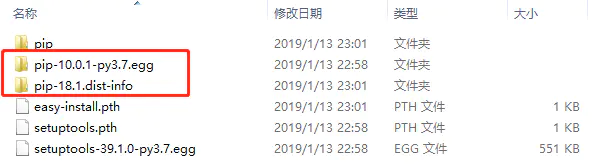

#### 安装 python 3.10

下载安装包

```
wget https://www.python.org/ftp/python/3.10.0/Python-3.10.0.tgz
tar zxvf Python-3.10.0.tgz
```

安装

```
cd Python-3.10.0
./configure --enable-optimizations
make
make install
cp /usr/local/bin/python3 /usr/bin/
```


#### 创建虚拟环境

确定要放置它的目录，并将 [`venv`](https://docs.python.org/zh-cn/3/library/venv.html#module-venv) 模块作为脚本运行目录路径

> python3.3  之前的版本没有这个功能
>
> tutorial-env 为虚拟环境的目录

```
python3 -m venv tutorial-env
```

在 Windows 上激活

```
tutorial-env\Scripts\activate.bat
```

在 Linux 或 MacOS 上激活

```
source tutorial-env/bin/activate
```


#### pip 命令

安装最新版本的包

```
pip install novas
```

安装指定版本的包

```
pip install requests==2.6.0
```

升级 pip 

```
pip install --upgrade pip
```

显示虚拟环境中安装的所有软件包

```
pip list
```

显示有关特定包的信息

```
pip show requests
```

生成一个已安装包列表

```
pip freeze > requirements.txt
```

从 requirements.txt 安装所需要的包

```
pip install -r requirements.txt
```


#### Pycharm中虚拟环境下更新pip

在Pycharm中使用虚拟环境（默认设置）创建新项目后，发现pip版本为10.0.1，想要更新到18.1则提示更新失败，解决办法如下。

根据提示，使用如下命令更新pip

```
python -m pip install --upgrade pip
```

结果提示更新失败，但是通过settings已经可以看到pip版本为18.1

删除venv  Lib\site-packages下的pip文件夹（包括10.0.1和18.1两个文件夹）



再次使用python -m pip install --upgrade pip命令进行更新，提示更新成功。查看已安装库，可以看到pip版本已经是18.1