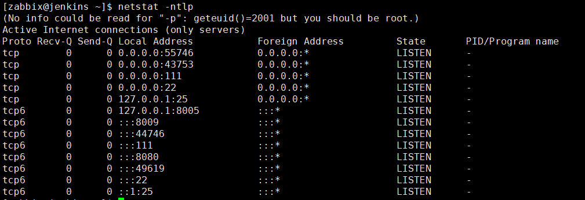
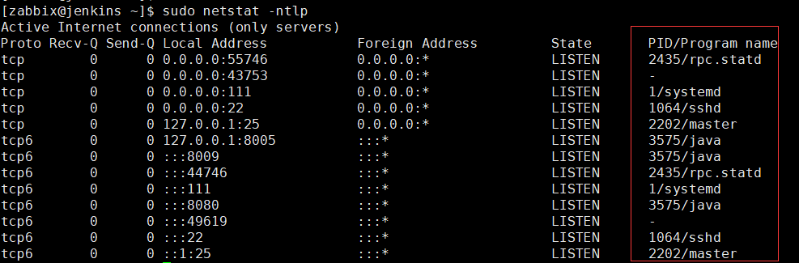

#### 配置 sudo 解决命令 netstat 输出不显示进程名的问题

未配置 sudo 前执行 netstat，输出如下



配置 sudo

```
[root@jenkins ~]# visudo
在"root    ALL=(ALL)       ALL"下添加一下行
zabbix ALL=(ALL) NOPASSWD: /usr/bin/netstat
```

使用命令 sudo 执行 netstat 



