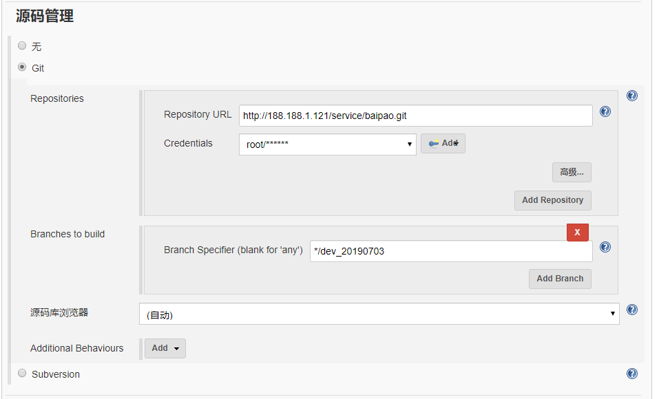
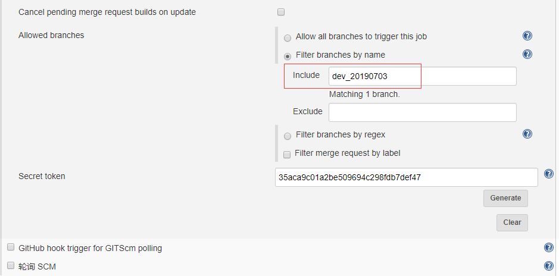
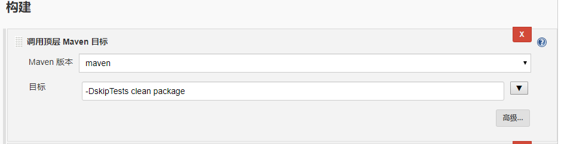
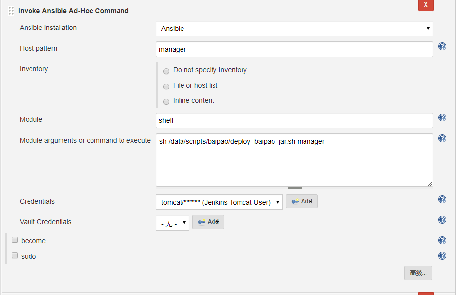

在 Jenkins 上创建任务


源码管理设置



如果有多分支，可以在 "构建触发" 中指定分支，自有该分支提交才会触发



配置打包方式



配置 Ansible



deploy_baipao_jar.sh 脚本内容

```shell
#!/bin/bash
source ~/.bash_profile 
pkg_name=baipao-$1.jar
pkg_from=`awk -v var=$1 '{if($1 == var) print $2}' /data/scripts/baipao/pkg_info.txt`
pkg_to=/usr/local/baipao/$1
if [ "$pkg_from" = "" ] ;then
    echo "包 $pkg_name 不存在!"
    exit
fi
cd $pkg_to
kill -9 `ps -ef | grep "$pkg_name" | grep -v grep | awk '{print $2}'`
mv $pkg_name /tmp/$pkg_name.`date +%s`
scp root@188.188.1.132:$pkg_from $pkg_name
chmod 755 $pkg_name
nohup java -Xms256M -Xmx512M -jar $pkg_name >/dev/null 2>&1 &
sleep 3s
pkg_pid=`ps -ef | grep "$pkg_name" | grep -v grep | awk '{print $2}'`
while ! netstat -ntlp | grep java | grep $pkg_pid
do
    echo "$pkg_name 正在启动 ......"
    sleep 10s
done
echo "$pkg_name 在节点 `hostname` 启动成功！"
rm -f `ls -t /tmp/$pkg_name.* | tail -n +4`
```

pkg_info.txt 文件内容

```
contract /root/.jenkins/workspace/NewBaipaoJava/baipao-contract/baipao-contract-service/target/baipao-contract-service-2.0.0.jar
driverapp /root/.jenkins/workspace/NewBaipaoJava/baipao-driver-app-rest/target/baipao-driver-app-rest-2.0.0.jar
manager /root/.jenkins/workspace/NewBaipaoJava/baipao-manager-rest/target/baipao-manager-rest-2.0.0.jar
gps /root/.jenkins/workspace/NewBaipaoJava/baipao-gps-fence/baipao-gps-fence-service/target/baipao-gps-fence-service-2.0.0.jar
schedule /root/.jenkins/workspace/NewBaipaoJava/baipao-schedule-rest/target/baipao-schedule-rest-2.0.0.jar
```

