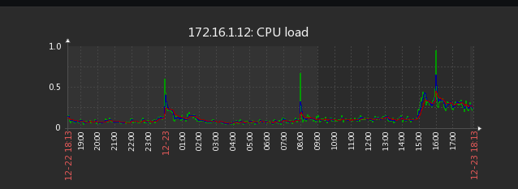
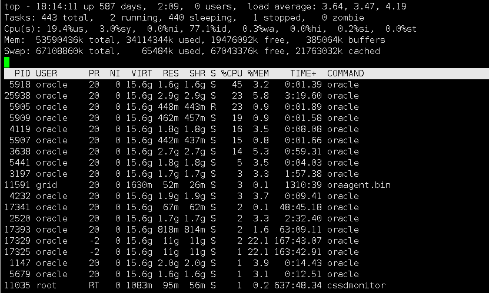
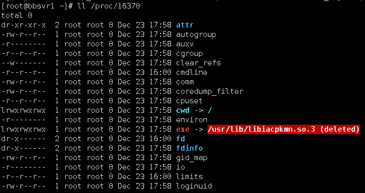
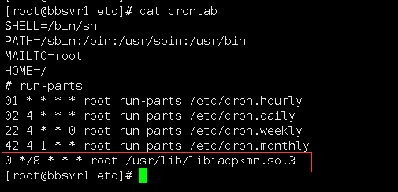

## 由于挖矿程序引起 CPU 异常高的处理流程

> 参考文档：[彻底清除libiacpkmn.so.3挖矿病毒方法](https://www.xuwenweb.com/article/show-42.html)

**监控系统显示服务器每隔8小时 CPU 使用率异常的高**



**使用 top 命令查看进程一切正常**



**使用 ps 命令查看到一个进程 CPU 使用率达到 500以上**

```
ps aux --sort=-pcpu | head -10
root     16370  571  3.9 2455008 2134576 ?     Ssl  16:00   4:28 [kdmflush] 
```

**查看该进程的文件目录发现运行的是 exe -> /usr/lib/libiacpkmn.so.3 (deleted)**



**查看定时任务文件，确定确实有定时任务存在，将其注释**

