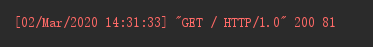
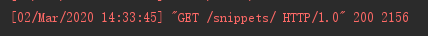

#### 通过 ajax 访问 django 报错

错误信息

```
Access to XMLHttpRequest at 'http://127.0.0.1:8000/o/token/' from origin 'http://192.168.1.118:88' has been blocked by CORS policy: No 'Access-Control-Allow-Origin' header is present on the requested resource.
```

处理方法

1、创建中间件 middlewares.py

```python
from django.utils.deprecation import MiddlewareMixin

class SetAccessControlAllowOrigin(MiddlewareMixin):
    def process_response(self, request, response):
        response['Access-Control-Allow-Origin'] = '*'
        return response
```

2、引入中间件

```python
MIDDLEWARE = [
    ...
    'djrf01.middlewares.SetAccessControlAllowOrigin'
]
```


#### nginx 反向代理 django 前后端 uri 不一致

> 猜测是 nginx 直接代理到开发环境的原因

nginx  location 配置如下

```
location /snippets/ {
    proxy_redirect off; 
    proxy_pass http://127.0.0.1:8000/;
}
```

django 接收到的请求如下



nginx location 配置改为如下

```
location /snippets/ {
    proxy_redirect off; 
    proxy_pass http://127.0.0.1:8000/snippets/;
}
```

django 可以接收到正确的 uri



