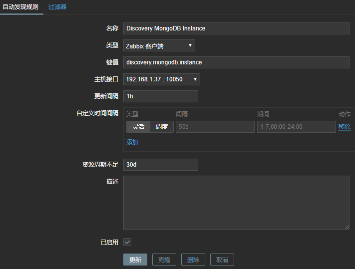
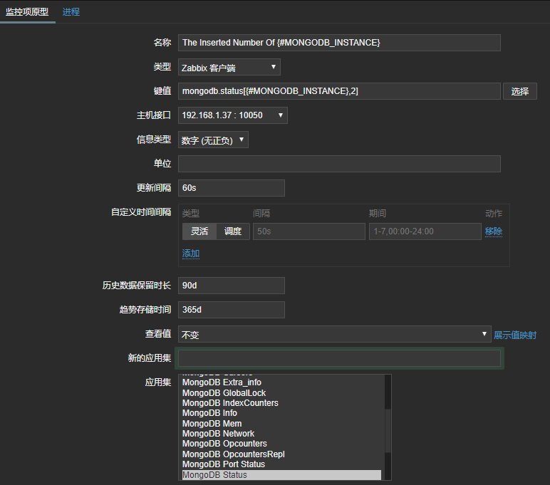

通过脚本 discovery_mongodb_instance.sh 获取 MongoDB 分片集群各实例，并格式化，供 Zabbix 识别

```
# 脚本内容
#!/bin/bash
instance=(`/usr/local/mongodb/bin/mongostat --port 20000 --discover -n 2 -o "host" | grep 192`)
length=${#instance[@]}
echo "{"
echo '    "data":['
for ((i=0;i<$length;i++))
do
    if [ $i -lt $[$length-1] ];then
        echo "        {\"{#MONGODB_INSTANCE}\":\"${instance[$i]}\"},"
    else
        echo "        {\"{#MONGODB_INSTANCE}\":\"${instance[$i]}\"}"
    fi
done
echo '    ]'
echo "}"
# 脚本执行的结果
{
    "data":[
        {"{#MONGODB_INSTANCE}":"192.168.1.37:27001"},
        {"{#MONGODB_INSTANCE}":"192.168.1.37:27003"},
        {"{#MONGODB_INSTANCE}":"192.168.1.38:27001"},
        {"{#MONGODB_INSTANCE}":"192.168.1.38:27002"},
        {"{#MONGODB_INSTANCE}":"192.168.1.39:27002"},
        {"{#MONGODB_INSTANCE}":"192.168.1.39:27003"}
    ]
}
```

通过脚本 get_mongodb_status.sh  获取 MongoDB 各实例的状态，输出到文件 mongodb_status.txt

```
# 脚本内容
#!/bin/bash
/usr/local/mongodb/bin/mongostat --port 20000 --discover -n 2 -o "host,insert,query,update,delete,getmore,command,dirty,used,flushes,vsize,res,faults,qrw,arw,net_in,net_out,conn,set,repl" | grep 192 | sed 's/\*/ /g' >/tmp/mongodb_status.txt
# 添加到定时任务
* * * * * sh /home/zabbix/scripts/get_mongodb_status.sh >/dev/null 2>&1
```

为脚本添加执行权限

```
chmod +x discovery_mongodb_instance.sh get_mongodb_status.sh
```

修改 Zabbix 配置文件，添加以下内容，并重启 Zabbix

```
UserParameter=discovery.mongodb.instance[*],/home/zabbix/scripts/discovery_mongodb_instance.sh
UserParameter=mongodb.status[*],grep $1 /tmp/mongodb_status.txt | awk -v n=$2 '{print $n}'
```

在 Zabbix 新增自动发现规则



在 Zabbix 上添加监控项原型

