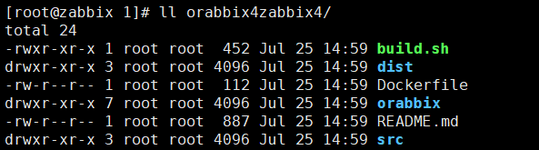
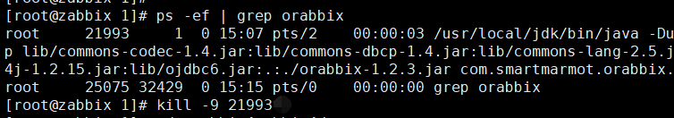

获取代码

```
git clone https://github.com/hsnotebook/orabbix4zabbix4.git
```



重新打包 orabbix-1.2.3.jar

```
cd orabbix4zabbix4
sh build.sh
```

停止 orabbix



更新 orabbix-1.2.3.jar 包

```
mv /usr/local/orabbix/orabbix-1.2.3.jar /usr/local/orabbix/orabbix-1.2.3.jar.bk
cp dist/orabbix-1.2.3.jar /usr/local/orabbix/
```

启动 orabbix

```
cd /usr/local/orabbix/
sh run.sh
```

